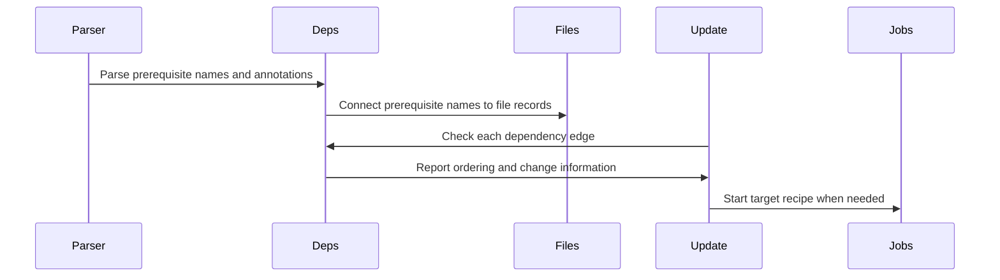

# Chapter 6: struct dep

Suppose a target needs a directory, a generated header, and two object files:

```make
app: main.o util.o generated/config.h | build
	$(CC) -o $@ $^
```

All four names are prerequisites, but they do not mean exactly the same thing.

- `main.o`, `util.o`, and `generated/config.h` can make `app` out of date.
- `build` must exist before the recipe runs, but changing the directory should not force relinking.
- Some prerequisites may be written using variables that must wait for automatic variables such as `$@`.
- Some may sit after `.WAIT`, meaning Make must not start work on them until earlier work has finished.

How does Make remember those distinctions?

A **struct dep** is one edge in Make's dependency graph, connecting a target to a prerequisite. Besides the prerequisite file, it records details such as order-only status, whether it changed, deferred secondary expansion, and `.WAIT` barriers. Think of it as an arrow on a workflow diagram, annotated with rules about how strongly one task depends on another.

The definition appears in [`src/dep.h`](https://github.com/mirror/make/blob/master/src/dep.h). GNU Make uses a macro so the same core fields can describe both ordinary prerequisites and top-level goals:

```c
#define DEP(_t)                                 \
    NAMESEQ (_t);                               \
    struct file *file;                          \
    _t *shuf;                                   \
    const char *stem;                           \
    unsigned int flags : 8;                     \
```

Then the rest of the metadata follows:

```c
    unsigned int changed : 1;                   \
    unsigned int ignore_mtime : 1;              \
    unsigned int staticpattern : 1;             \
    unsigned int need_2nd_expansion : 1;        \
    unsigned int ignore_automatic_vars : 1;     \
```

```c
    unsigned int is_explicit : 1;               \
    unsigned int wait_here : 1
```

The ordinary dependency record is simply:

```c
struct dep
  {
    DEP (struct dep);
  };
```

That compact definition carries a great deal of build policy.

## From a Makefile line to dependency arrows

The parser from [eval](04_eval.md) reads a rule such as:

```make
app: main.o util.o | build
```

and eventually passes its prerequisite text to `split_prereqs()` in `src/file.c`.

```c
deps = split_prereqs (depstr);
```

The resulting chain is attached to the target’s `struct file`:

```text
app file record
    ↓
main.o dep → util.o dep → build dep
```

The target record itself was covered in [struct file](05_struct_file.md). The key distinction is:

```text
struct file  = a node in the graph
struct dep   = one arrow leaving that node
```

For the example above, the graph is conceptually:

```text
app
 ├── main.o
 ├── util.o
 ├── generated/config.h
 └── build
```

But `struct dep` adds annotations that the plain diagram cannot show:

```text
app ── normal prerequisite ──> main.o
app ── normal prerequisite ──> util.o
app ── normal prerequisite ──> generated/config.h
app ── order-only prerequisite ──> build
```

The arrows are not all equally strong.

## A dependency begins as a name

The first fields come from `NAMESEQ`:

```c
#define NAMESEQ(_t)     \
    _t *next;           \
    const char *name
```

So every `struct dep` has:

```c
struct dep *next;
const char *name;
```

The `next` pointer creates a linked list. A target with three prerequisites has three dependency records chained together.

The `name` field is useful while Make still has only text. For example, while parsing:

```make
app: main.o util.o
```

Make may initially hold:

```text
name: main.o
file: null
```

and then:

```text
name: util.o
file: null
```

Later, Make resolves those names into `struct file` records.

The helper macro `dep_name()` hides the transition:

```c
#define dep_name(d)       ((d)->name ? (d)->name : (d)->file->name)
```

Read it as:

> If this dependency still has a textual name, use it. Otherwise, use the name from its linked file record.

That lets code work during both phases:

| Phase | `name` | `file` |
|---|---|---|
| Just parsed | set | often null |
| Entered into file database | null | set |
| Deferred second expansion | set | null until later |

It is like a shipping label that initially contains only a written address, then later points to a customer record in a logistics system.

## Turning names into file records

For ordinary prerequisites, `enter_prereqs()` performs the conversion.

```c
d1->file = lookup_file (d1->name);
if (d1->file == 0)
  d1->file = enter_file (d1->name);

d1->name = 0;
```

The steps are:

1. Look for an existing `struct file` for the prerequisite name.
2. Create one if Make has never seen the name before.
3. Store the resulting file pointer in `d1->file`.
4. Clear `d1->name`, because the file record now owns the canonical identity.

For:

```make
app: main.o
```

the dependency changes from this:

```text
dep
 ├── name: main.o
 └── file: null
```

to this:

```text
dep
 ├── name: null
 └── file: pointer to the main.o file record
```

This connection matters because the update engine needs far more than a string. It needs to know whether `main.o` exists, has a recipe, has prerequisites of its own, is phony, or is already being built.

Those details belong to [struct file](05_struct_file.md). `struct dep` is the bridge from one file card to another.

## Normal prerequisites: changes propagate upward

A normal prerequisite expresses the familiar Make rule:

> Build the prerequisite first. If it changed, or if it is newer than the target, the target may need rebuilding.

For:

```make
app: main.o
```

if `main.o` is newer than `app`, Make should relink `app`.

During the update walk, `update_file_1()` checks each dependency’s timestamp:

```c
d_mtime = file_mtime (d->file);

if (! d->ignore_mtime)
  {
    deps_changed |= d->changed;
  }
```

The important condition is:

```c
if (! d->ignore_mtime)
```

A normal dependency has `ignore_mtime == 0`, so it participates in the timestamp decision.

Make also updates the edge’s `changed` bit:

```c
d->changed |= noexist || d_mtime > this_mtime;
```

This means the dependency is considered changed when:

- the target does not exist, or
- the prerequisite is newer than the target.

The bit is also set when Make actually rebuilt the prerequisite earlier in the same run.

Think of a normal dependency arrow as a strong pull cord. If the prerequisite moves, the target is pulled along and may need rebuilding too.

## `changed`: one edge’s answer to “did this matter?”

The field is:

```c
unsigned int changed : 1;
```

It does not simply mean “the prerequisite file exists” or “the prerequisite was mentioned in the Makefile.”

It means something more operational:

> Did this prerequisite change in a way relevant to this target’s update decision?

Suppose this is the state:

```text
app exists and is older
main.o was rebuilt
util.o did not change
```

The dependency records may end up conceptually like:

```text
main.o changed: 1
util.o changed: 0
```

Make uses this information for both rebuild decisions and automatic variables.

The `$?` automatic variable contains normal prerequisites that changed:

```make
app: main.o util.o
	@echo changed prerequisites are $?
```

`set_file_variables()` in `src/commands.c` checks the same bit:

```c
if (d->changed || always_make_flag)
  {
    qp = mempcpy (qp, c, len);
  }
```

So `struct dep.changed` directly helps produce `$?`.

This is a useful connection:

```text
timestamp comparison
    ↓
dep changed bit
    ↓
rebuild decision and automatic variable value
```

The dependency edge remembers the result of Make’s earlier reasoning so that later stages do not need to rediscover it.

## Order-only prerequisites: required, but not timestamp triggers

Now consider a common build-directory rule:

```make
app: main.o | build
	$(CC) -o $@ main.o
```

```make
build:
	mkdir -p $@
```

The `build` directory must exist before the recipe can place output inside it. But directories often receive a newer timestamp whenever files are created or removed inside them.

If `build` were a normal prerequisite, every directory timestamp change could force unnecessary relinking.

The vertical bar creates an **order-only prerequisite**:

```make
app: main.o | build
```

The parser divides the prerequisite list at `|`.

```c
struct dep *
split_prereqs (char *p)
{
  struct dep *new = PARSE_FILE_SEQ (&p, struct dep, MAP_PIPE,
                                    NULL, PARSEFS_WAIT);
```

If text remains after the pipe, Make parses it separately:

```c
ood = PARSE_FILE_SEQ (&p, struct dep, MAP_NUL,
                      NULL, PARSEFS_WAIT);
```

Then it marks every dependency after the pipe:

```c
for (; ood != NULL; ood = ood->next)
  ood->ignore_mtime = 1;
```

The field is:

```c
unsigned int ignore_mtime : 1;
```

The name is precise. An order-only prerequisite is not ignored. Make still builds it first if necessary. Its **modification time** is what Make ignores when deciding whether the target is stale.

| Property | Normal prerequisite | Order-only prerequisite |
|---|---:|---:|
| Must be updated before target | yes | yes |
| Missing prerequisite can block target | yes | yes |
| Newer timestamp can remake target | yes | no |
| Appears in `$^` | yes | no |
| Appears in `$|` | no | yes |
| Can appear in `$?` | yes | no |

An order-only dependency is like requiring that a workshop be unlocked before work begins. Opening or closing the door does not mean the product itself must be rebuilt.

## Why order-only prerequisites still matter

It would be a mistake to think `ignore_mtime` means “skip this dependency.”

In `update_file_1()`, Make still traverses every prerequisite:

```c
new = check_dep (d->file, depth, this_mtime, &maybe_make);
```

So an order-only prerequisite may be built, may fail, and may delay the target.

Only after that does Make decide whether its result affects `must_make`:

```c
if (! d->ignore_mtime)
  must_make = maybe_make;
```

A normal prerequisite can change `must_make`. An order-only one cannot.

For example:

```make
report.txt: data.csv | output
	tool data.csv > output/report.txt
```

If `output` is missing, Make creates it. If `output` already exists but has a fresh timestamp, Make does not rebuild `report.txt` merely because the directory changed.

That behavior is not a special case scattered through Make. It is a small flag attached to one graph edge.

## Automatic variables read dependency metadata

`struct dep` does not only guide the update engine. It also shapes recipe variables.

For this rule:

```make
app: main.o util.o | build
	@echo normal prerequisites: $^
	@echo order only prerequisites: $|
```

Make computes:

```text
$^  = main.o util.o
$|  = build
```

The code in `set_file_variables()` separates them:

```c
if (d->ignore_mtime)
  {
    bp = mempcpy (bp, c, len);
  }
else
  {
    cp = mempcpy (cp, c, len);
  }
```

The `bp` buffer becomes `$|`; the `cp` buffer contributes to `$^`.

Similarly, `$<` skips order-only dependencies:

```c
for (d = file->deps; d != 0; d = d->next)
  if (!d->ignore_mtime && !d->ignore_automatic_vars
      && !d->need_2nd_expansion)
```

So `$<` is the first normal prerequisite, not merely the first dependency record in the list.

This is an excellent example of why Make cannot represent dependencies as bare strings. Recipe expansion needs to know what kind of relationship each prerequisite has.

Variable expansion itself is explained in [variable_expand](03_variable_expand.md), while automatic variables are attached to the target context through [variable_set_list](02_variable_set_list.md).

## Delayed prerequisite text and `.SECONDEXPANSION`

Most prerequisite lists are expanded while Make reads the Makefile:

```make
OBJECTS = main.o util.o

app: $(OBJECTS)
```

The parser expands `$(OBJECTS)` and stores ordinary dependency records for `main.o` and `util.o`.

But sometimes a prerequisite needs information that does not exist until Make is considering a specific target.

For example:

```make
.SECONDEXPANSION:

app: $$(deps_for_$@)
```

The doubled dollar sign delays the reference. During initial parsing, Make cannot yet use `$@` as `app` in the ordinary way.

When `.SECONDEXPANSION` is enabled and the prerequisite text contains `$`, `record_files()` preserves the text rather than splitting it immediately:

```c
if (second_expansion && strchr (depstr, '$'))
  {
    deps = alloc_dep ();
    deps->name = depstr;
```

Then it marks the special dependency record:

```c
deps->need_2nd_expansion = 1;
```

The field is:

```c
unsigned int need_2nd_expansion : 1;
```

At this stage, one `struct dep` may represent an entire *unexpanded prerequisite expression*, not just one final prerequisite file.

Conceptually, Make stores:

```text
name: $$(deps_for_$@)
file: null
need second expansion: yes
```

This is like storing an unopened envelope rather than filing its contents immediately.

## The second-expansion handoff

Later, when Make is about to consider a target, `expand_deps()` checks for deferred dependency records:

```c
if (! d->name || ! d->need_2nd_expansion)
  {
    dp = &d->next;
    d = d->next;
    continue;
  }
```

For a deferred record, Make prepares target-specific variables and automatic variables:

```c
initialize_file_variables (f, 0);
set_file_variables (f, d->stem ? d->stem : f->stem);
```

Then it expands the stored text in that target’s variable context:

```c
p = variable_expand_for_file (d->name, f);
```

Now `$@`, `$*`, target-specific variables, and matching pattern-specific variables can have meaningful values.

Finally, Make parses the result into ordinary dependency records:

```c
new = split_prereqs (p);
```

The placeholder dependency is removed and replaced with the newly parsed chain.

For example:

```make
.SECONDEXPANSION:

app: $$(deps_for_$@)
deps_for_app = main.o util.o
```

The lifecycle is:

```text
initial parse:
  one deferred dep containing dependency expression

target consideration:
  expand expression with target name app

final graph:
  app → main.o
  app → util.o
```

A deferred dependency is therefore not a missing file pointer by accident. It is deliberately incomplete until the correct target context exists.

## Secondary expansion and target-specific variables

Second expansion becomes especially useful with target-specific variables.

```make
.SECONDEXPANSION:

debug: objects = main-debug.o util-debug.o
release: objects = main-release.o util-release.o

debug release: $$(objects)
```

During the first parse, the prerequisite text remains deferred.

Later:

- while considering `debug`, Make sees `objects = main-debug.o util-debug.o`;
- while considering `release`, Make sees `objects = main-release.o util-release.o`.

That works because `expand_deps()` calls `variable_expand_for_file()`, which temporarily activates the target’s variable scope chain.

The scope chain is covered in [variable_set_list](02_variable_set_list.md). The important dependency lesson is:

> `need_2nd_expansion` tells Make that this edge cannot be finalized until the target’s variable world is available.

## `staticpattern` and the meaning of `%`

The field:

```c
unsigned int staticpattern : 1;
```

is used for dependencies belonging to static pattern rules.

A static pattern rule looks like this:

```make
objects = main.o util.o

$(objects): %.o: %.c
	$(CC) -c $< -o $@
```

Here `%` is not an ordinary filename character. It stands for the stem matched from each target:

```text
main.o → main.c
util.o → util.c
```

For normal static-pattern prerequisites, `enter_prereqs()` replaces `%` using the target’s stem.

```c
if (stem)
  {
    const char *pattern = "%";
    ...
    o = patsubst_expand_pat (variable_buffer, stem, pattern, nm,
                             pattern+1, percent+1);
  }
```

Then it records the stem on the dependency:

```c
dp->stem = stem;
dp->staticpattern = 1;
```

Why preserve this information?

Because secondary expansion can delay processing. If a static-pattern prerequisite needs a second expansion, Make must later know that `%` should behave like the relevant target’s stem.

Inside `expand_deps()`, Make translates `%` into `$*` before the delayed expansion:

```c
*(s++) = '$';
*(s++) = '*';
```

That avoids expanding a literal stem more than once. `$*` is an automatic variable whose value is already prepared for the target.

The basic pattern-rule machinery is the subject of [struct rule](07_struct_rule.md). Here, the main point is that `staticpattern` tells a dependency edge, “my name came from a stem-based rule, so preserve that context.”

## Explicitness and intermediate files

The field:

```c
unsigned int is_explicit : 1;
```

is mostly important during implicit-rule search.

Suppose Make needs `program`, and it finds an implicit route:

```text
program ← program.o ← program.c
```

The object file may be a temporary intermediate artifact. But if `program.o` was explicitly named elsewhere, Make should be more cautious about treating it as disposable.

When implicit-rule search examines a prerequisite, it records whether the prerequisite was written explicitly in the rule:

```c
d->is_explicit = is_explicit;
```

Later, it combines that edge-level fact with the target file’s own `is_explicit` state:

```c
if (df && !df->is_explicit && !d->is_explicit)
  df->intermediate = 1;
```

Read that as:

- if the prerequisite file was not explicitly mentioned elsewhere, and
- this dependency was not explicitly named in the current rule,

then Make may classify it as an intermediate file.

This is another place where the edge matters separately from the node.

A `struct file` can say:

```text
I am main.o.
```

A `struct dep` can say:

```text
main.o was inferred through this pattern-rule path.
```

That distinction helps Make decide whether the file is a durable project artifact or a temporary stepping stone.

## `.EXTRA_PREREQS` and hidden recipe inputs

GNU Make supports `.EXTRA_PREREQS`, which adds prerequisites to targets without putting them into ordinary automatic variables.

For example:

```make
app: .EXTRA_PREREQS = config.stamp
```

The target should wait for `config.stamp`, and changes to it can remake `app`. But sometimes a Makefile author does not want the extra prerequisite to appear in `$^` or `$<`.

That behavior uses:

```c
unsigned int ignore_automatic_vars : 1;
```

When Make expands extra prerequisites, it marks them:

```c
d->ignore_automatic_vars = 1;
```

The helper is:

```c
struct dep *
expand_extra_prereqs (const struct variable *extra)
{
  struct dep *prereqs =
    extra ? split_prereqs (variable_expand (extra->value)) : NULL;
```

The dependency is real for scheduling and timestamp checks. It is simply hidden from the standard automatic variable lists.

`set_file_variables()` consistently filters these edges:

```c
if (d->need_2nd_expansion || d->ignore_automatic_vars)
  continue;
```

This is like an internal checklist item on a work order. It must be completed before the job, but it is not printed on the public materials list.

## `.WAIT`: a barrier between prerequisite groups

GNU Make can represent ordering barriers within a prerequisite list:

```make
all: first second .WAIT third fourth
```

The intended meaning is:

1. `first` and `second` may run in parallel.
2. `third` and `fourth` must wait until the earlier group has completed.
3. `third` and `fourth` may then run in parallel with each other.

The `.WAIT` token is not retained as an ordinary prerequisite file. Instead, the parser sees it and sets a flag for the dependency after it.

Inside `parse_file_seq()`:

```c
if (ANY_SET (flags, PARSEFS_WAIT)
    && p - s == CSTRLEN (".WAIT")
    && memcmp (s, ".WAIT", CSTRLEN (".WAIT")) == 0)
```

Make records that it found a barrier:

```c
found_wait = 1;
continue;
```

When it creates the next dependency record, it transfers the marker:

```c
if (found_wait) {
  ((struct dep*)_ns)->wait_here = 1;
  found_wait = 0;
}
```

So this Makefile:

```make
all: first second .WAIT third fourth
```

produces a dependency shape like:

```text
first   wait_here: 0
second  wait_here: 0
third   wait_here: 1
fourth  wait_here: 0
```

The barrier belongs to `third`, not to a separate `.WAIT` file node.

That is a neat representation: the edge says, “before crossing into me, wait for earlier work.”

## How `.WAIT` affects parallel scheduling

While Make scans a target’s prerequisites, it tracks whether any previous prerequisite jobs are still running:

```c
int running = 0;
```

Before processing the next dependency, it checks the barrier bit:

```c
if (d->wait_here && running)
  break;
```

If Make reaches a dependency marked `wait_here` while earlier work is still running, it stops scanning there for now.

On a later pass, after those jobs finish, Make can continue beyond the barrier.

This produces the desired behavior:

```text
first and second begin
    ↓
Make reaches third and sees wait marker
    ↓
Make pauses later prerequisites
    ↓
first and second complete
    ↓
third and fourth may begin
```

`.WAIT` is not a global “turn off parallelism” switch. It is a local fence in one dependency list.

It is like placing a gate in an assembly line:

```text
parallel preparation work
    ↓
quality gate
    ↓
parallel packaging work
```

The update engine itself is covered more fully in [update_goal_chain](08_update_goal_chain.md), but `wait_here` is the small piece of edge metadata that gives it this scheduling instruction.

## `.WAIT` also works around the order-only split

Because `.WAIT` is processed while parsing file sequences, it can appear among normal or order-only prerequisites.

For example:

```make
app: objects .WAIT generated.h | build
```

The barrier applies before `generated.h`.

Or:

```make
app: objects | build .WAIT cache
```

The barrier applies before `cache` within the order-only portion.

When Make prints its database, `print_prereqs()` reconstructs the marker:

```c
printf (" %s%s", deps->wait_here ? ".WAIT " : "",
        dep_name (deps));
```

This is a good reminder that `.WAIT` is stored as a bit on a nearby dependency edge, then converted back into familiar Makefile syntax for diagnostics.

## `shuf`: a second route through the same dependencies

The `shuf` field is:

```c
struct dep *shuf;
```

The normal `next` pointer preserves the parsed dependency order:

```text
first → second → third
```

But Make’s `--shuffle` option can create another traversal order through the same records.

When the update engine selects the current dependency, it chooses:

```c
d = du->shuf ? du->shuf : du;
```

Likewise, top-level goals may use shuffled links.

The key design is that Make does not need to physically reorder the original `next` chain. It can preserve the canonical list and add a second link path for a shuffled traversal.

That is like keeping a book’s pages in publication order while adding a separate reading itinerary:

```text
physical page order:  chapter one, chapter two, chapter three
study order:          chapter two, chapter one, chapter three
```

The `shuf` pointer matters especially for testing. Shuffling prerequisites can reveal Makefiles that accidentally depend on an unstated ordering relationship.

For example, this is unsafe:

```make
app: generated.h main.o
```

if `main.o` actually needs `generated.h` but does not declare it. A shuffle may expose the missing edge.

A correct graph should state the relationship directly:

```make
main.o: generated.h
app: main.o
```

## Why dependency records keep duplicates

`struct file.deps` is documented as containing:

```c
struct dep *deps;  /* all dependencies, including duplicates */
```

That is intentional.

Suppose a Makefile says:

```make
app: main.o util.o main.o
```

Make may retain the duplicate dependency records because some automatic variables preserve listing behavior.

For example:

- `$+` keeps duplicates in Makefile order.
- `$^` removes duplicates.
- `$?` removes duplicates among changed normal prerequisites.

The dependency list retains the original information; recipe-variable construction decides how much to normalize.

Inside `set_file_variables()`, Make first computes `$+` by walking the dependency list directly. Later it builds a hash table to remove duplicates for `$^`, `$?`, and `$|`.

```c
hash_init (&dep_hash, 500, dep_hash_1, dep_hash_2, dep_hash_cmp);
```

This separation is useful:

```text
struct dep list preserves what was declared
automatic-variable logic chooses the view to present
```

It is like retaining a complete invoice with repeated line items, then producing a summary report that combines identical products.

## `flags`: shared policy bits

The `flags` field is:

```c
unsigned int flags : 8;
```

For ordinary `struct dep` records attached to target files, this field is not the main star of the dependency update logic shown in this chapter.

Its importance becomes clearer because `DEP()` is reused by `struct goaldep`:

```c
struct goaldep
  {
    DEP (struct goaldep);
    int error;
    floc floc;
  };
```

A `struct goaldep` is a dependency-shaped record for a top-level goal or Makefile being read.

For example, Makefile-reading code creates a goal dependency with flags such as:

```c
RM_INCLUDED
RM_DONTCARE
RM_NO_DEFAULT_GOAL
```

Those flags describe policies such as:

- this file came from `include`;
- failure to find it may be acceptable;
- its rules should not set the default goal.

The constants are defined in `dep.h`:

```c
#define RM_NO_DEFAULT_GOAL      (1 << 0)
#define RM_INCLUDED             (1 << 1)
#define RM_DONTCARE             (1 << 2)
#define RM_NO_TILDE             (1 << 3)
```

This reuse is a practical C design choice. Both ordinary prerequisites and top-level goals need:

- a name or file pointer;
- a linked-list next pointer;
- a possible shuffled traversal link;
- a changed bit;
- some flags.

But `goaldep` adds information specific to reading Makefiles:

```c
int error;
floc floc;
```

The idea is:

```text
struct dep     = an ordinary edge from one target to one prerequisite
struct goaldep = a dependency-shaped entry point with source and error data
```

## Goal dependencies at startup

When you run:

```sh
make app
```

`main.c` enters `app` as a file record, then creates a goal record:

```c
lastgoal = alloc_goaldep ();
lastgoal->file = f;
```

This is the root of the later update walk.

The update engine receives a chain of `struct goaldep` records:

```c
enum update_status
update_goal_chain (struct goaldep *goaldeps)
```

It copies that chain using the generic dependency-copy helper:

```c
struct dep *goals_orig = copy_dep_chain ((struct dep *)goaldeps);
```

The cast works because `struct goaldep` begins with the same `DEP()` fields as `struct dep`.

This may look unusual at first, but the shared layout is deliberate. It lets Make use generic chain operations while preserving extra goal-only metadata where needed.

## Copying a dependency chain

Dependency lists are frequently copied.

For example, a static pattern rule with several targets cannot attach the *same* prerequisite nodes to every target. Each target needs its own independently owned chain.

In `record_files()`:

```c
this = nextf != 0 ? copy_dep_chain (deps) : deps;
```

All but the final target receive copied dependencies; the final target takes ownership of the original chain.

Likewise, grouped targets and implicit-rule searches copy dependency data when they need structurally separate graph edges.

Why not share one chain?

Because Make may later modify individual edges:

- resolve a name into a `file` pointer;
- replace a deferred second-expansion placeholder;
- mark `changed`;
- set `wait_here`;
- add shuffle links;
- remove a circular edge.

Sharing would make one target’s update state accidentally rewrite another target’s graph.

Each target needs its own set of arrows, even when those arrows initially point to the same prerequisite names.

## A full lifecycle for one dependency

Consider:

```make
.SECONDEXPANSION:

app: main.o | build
app: $$(extra_for_$@)
extra_for_app = generated/config.h
```

One dependency can travel through these stages.

### 1. Parsing

`main.o` becomes an ordinary dependency record:

```text
file: main.o file record
ignore_mtime: 0
need_2nd_expansion: 0
```

`build` becomes another record:

```text
file: build file record
ignore_mtime: 1
need_2nd_expansion: 0
```

The delayed expression becomes a placeholder:

```text
name: $$(extra_for_$@)
file: null
need_2nd_expansion: 1
```

### 2. Target consideration

When Make considers `app`, it expands the placeholder with `$@ = app`.

```text
$$(extra_for_$@)
    ↓
generated/config.h
```

The placeholder is replaced with an ordinary dependency edge pointing at the `generated/config.h` file record.

### 3. Prerequisite updates

Make recursively updates:

```text
main.o
build
generated/config.h
```

For each edge, Make records whether it changed.

### 4. Target decision

- A changed `main.o` can trigger rebuilding `app`.
- A changed `generated/config.h` can trigger rebuilding `app`.
- A changed `build` directory cannot trigger rebuilding `app`, because it is order-only.

### 5. Recipe variables

Make prepares:

```text
$^  = main.o generated/config.h
$|  = build
$?  = changed normal prerequisites only
```

The dependency records are the source data for all of those lists.

## The path through Make

Here is the broad flow from prerequisite text to target update.



The important part is that the dependency object stays relevant throughout the build:

- parsing creates it;
- graph construction connects it;
- secondary expansion may replace it;
- update traversal reads and writes its status;
- recipe setup reads it to create automatic variables;
- shuffling may add a second traversal path.

A dependency edge is not temporary parser debris. It is active build-state data.

## Reading `struct dep` in the source

When you first explore this area of GNU Make, these locations provide a useful map:

| Question | Main location |
|---|---|
| What fields describe one dependency? | `struct dep` and `DEP()` in `src/dep.h` |
| How are prerequisite names split at `|`? | `split_prereqs()` in `src/file.c` |
| How is `.WAIT` recognized? | `parse_file_seq()` in `src/read.c` |
| How do names become file records? | `enter_prereqs()` in `src/file.c` |
| Where is delayed secondary expansion performed? | `expand_deps()` in `src/file.c` |
| Where are dependencies checked for timestamps and changes? | `update_file_1()` in `src/remake.c` |
| Where does Make honor `.WAIT` barriers? | `update_file_1()` in `src/remake.c` |
| Where are `$^`, `$+`, `$?`, and `$|` assembled? | `set_file_variables()` in `src/commands.c` |
| Where are implicit-rule dependency flags copied? | `pattern_search()` in `src/implicit.c` |
| Where are dependencies printed by `make -p`? | `print_prereqs()` in `src/file.c` |

A productive debugging question is:

> Is this prerequisite still text, already linked to a file, waiting for second expansion, or carrying an update result?

The answer explains why some `struct dep` fields are populated while others are still empty.

## Practical debugging with `make -d` and `make -p`

When dependencies behave unexpectedly, start by asking what Make thinks the edges are.

Use:

```sh
make -p
```

This prints Make’s database. A rule may appear as:

```text
app: main.o util.o | build
```

If `.WAIT` is present, Make prints it back near the marked dependency:

```text
all: first second .WAIT third fourth
```

For timestamp and rebuild reasoning, use:

```sh
make --debug=b
```

or:

```sh
make -d
```

You may see messages such as:

```text
Prerequisite 'main.o' is newer than target 'app'.
Prerequisite 'build' is order-only for target 'app'.
Must remake target 'app'.
```

Those messages correspond closely to the `ignore_mtime` and `changed` fields described in this chapter.

For secondary expansion, a small diagnostic is often enough:

```make
.SECONDEXPANSION:

app: $$(info checking $@)$$(deps_for_$@)
```

The doubled dollars ensure that the `info` call waits for second expansion, when `$@` has the target value.

## A compact mental model

You can summarize `struct dep` as one annotated arrow:

```text
target ──[dependency policy]──> prerequisite
```

The most important annotations are:

| Field | Question it answers |
|---|---|
| `next` | What is the next prerequisite in this target’s list? |
| `name` | What prerequisite text is still waiting to be resolved? |
| `file` | Which `struct file` does this edge point to? |
| `shuf` | Is there an alternate shuffled traversal order? |
| `stem` | Which static-pattern stem belongs to this dependency? |
| `changed` | Did this prerequisite matter to the target’s update? |
| `ignore_mtime` | Is this prerequisite order-only? |
| `staticpattern` | Did this dependency originate in a static pattern rule? |
| `need_2nd_expansion` | Must Make expand this prerequisite text later? |
| `ignore_automatic_vars` | Should this edge stay out of `$^`, `$<`, and related variables? |
| `is_explicit` | Was this prerequisite explicitly named for implicit-rule purposes? |
| `wait_here` | Must earlier prerequisite work finish before this edge is considered? |

## Key takeaways

`struct dep` represents one prerequisite relationship, not merely one filename.

It lets GNU Make preserve the meaning of different dependency forms:

```make
target: normal-prerequisite
target: normal-prerequisite | order-only-prerequisite
target: earlier-work .WAIT later-work
target: $$(deferred_prerequisites)
```

The same dependency record can carry:

- a raw name before Make has entered it into the file database;
- a pointer to the prerequisite’s `struct file`;
- timestamp policy through `ignore_mtime`;
- update results through `changed`;
- delayed expansion state through `need_2nd_expansion`;
- static-pattern context through `stem` and `staticpattern`;
- automatic-variable visibility through `ignore_automatic_vars`;
- parallel-ordering barriers through `wait_here`;
- shuffled traversal links through `shuf`.

Most importantly, dependencies are not all equal. A normal prerequisite says, “if I change, you may need rebuilding.” An order-only prerequisite says, “I must be ready first, but my timestamp should not pull you out of date.” A `.WAIT` marker says, “do not cross this point until earlier work settles.” A deferred dependency says, “you cannot even know my final name until the target context exists.”

Now that the graph’s individual arrows are clear, you might wonder where Make stores reusable arrow patterns such as `%.o: %.c`, and how it chooses one when a target has no explicit recipe. That is the subject of [struct rule](07_struct_rule.md).