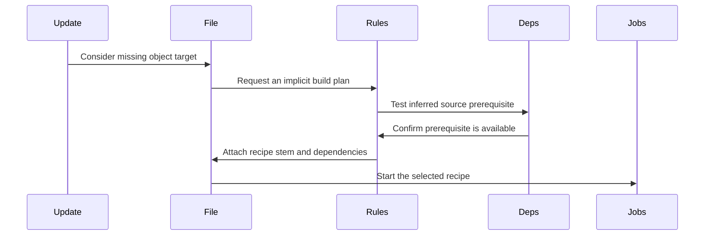

# Chapter 7: struct rule

You ask Make to build an object file:

```sh
make main.o
```

Your Makefile never mentions `main.o`.

It does contain this reusable instruction:

```make
%.o: %.c
	$(CC) -c $< -o $@
```

How does Make connect the requested `main.o` to that template, infer that it needs `main.c`, and decide whether the template is usable?

It cannot treat `%.o: %.c` as an ordinary target rule. There is no literal file named `%.o`. Instead, Make stores a reusable rule description, later tries that description against an actual target name, and fills in the `%` placeholder with a matching stem.

That reusable description is `struct rule`.

Think of it as a manufacturing template:

```text
Template says:      turn a source-shaped item into an object-shaped item
Requested item:     main.o
Matched raw item:   main.c
Production step:    compile main.c into main.o
```

The target `main.o` is represented by a [`struct file`](05_struct_file.md). The connection from `main.o` to `main.c` becomes a [`struct dep`](06_struct_dep.md). But before either can be connected, Make needs a reusable description of the pattern itself.

## The compact rule record

The definition is in [`src/rule.h`](https://github.com/mirror/make/blob/master/src/rule.h):

```c
struct rule
  {
    struct rule *next;
    const char **targets;
    unsigned int *lens;
    const char **suffixes;
```

```c
    struct dep *deps;
    struct commands *cmds;
    char *_defn;
    unsigned short num;
```

```c
    char terminal;
    char in_use;
  };
```

The fields fall into three groups:

| Group | Fields | Job |
|---|---|---|
| Pattern identity | `targets`, `lens`, `suffixes`, `num` | Describe what target names the rule can match |
| Build instructions | `deps`, `cmds` | Describe inferred prerequisites and recipe text |
| Search bookkeeping | `next`, `_defn`, `terminal`, `in_use` | Store, print, and safely search rules |

For the familiar rule:

```make
%.o: %.c
	$(CC) -c $< -o $@
```

Make stores something conceptually like this:

```text
targets[0]:  %.o
suffixes[0]: .o
deps:        %.c
cmds:        $(CC) -c $< -o $@
num:         1
```

The `%` is not expanded when Make reads the Makefile. It stays as a placeholder until Make has an actual requested target, such as `main.o`.

## One rule can describe multiple target patterns

The `targets` field is an array:

```c
const char **targets;
```

and `num` says how many entries the array contains:

```c
unsigned short num;
```

That accommodates pattern rules with more than one target pattern:

```make
%.tab.c %.tab.h: %.y
	bison -d -o $*.tab.c $<
```

Conceptually, this reusable template says:

```text
A stem plus tab.c may be made from a stem plus y.
A stem plus tab.h may be made from a stem plus y.
```

If Make is asked for `parser.tab.c`, it can match the first target pattern. If it is asked for `parser.tab.h`, it can match the second.

The rule remains one shared template. It does not become a separate full recipe record for every possible stem:

```text
parser.tab.c
scanner.tab.c
grammar.tab.c
...
```

That would be wasteful and impossible to finish in advance. A pattern rule is closer to a cookie cutter than a collection of already-cut cookies.

## Why store target lengths?

The next field is:

```c
unsigned int *lens;
```

Each entry caches the length of the matching target pattern.

For `%.o`:

```text
pattern: %.o
length:  3
```

For `src/%.o`:

```text
pattern: src/%.o
length: 7
```

During implicit-rule search, Make checks whether a pattern could possibly fit a target before doing more expensive comparisons:

```c
if (rule->lens[ti] > namelen)
  continue;
```

If Make is trying to build `a.o`, a pattern longer than three characters cannot match it.

This is the same kind of small performance choice seen in [`struct variable`](01_struct_variable.md), where variable names store their length. Make performs lookups and pattern checks frequently, so remembering a length avoids repeatedly calling `strlen()`.

It is like a tailor checking whether a piece of fabric is even long enough before trying to cut a detailed shape from it.

## `suffixes` points after `%`

The most confusing field name is probably:

```c
const char **suffixes;
```

It does not mean “a list of filename suffixes” in the everyday `.c` or `.o` sense.

Instead, each entry points **inside the corresponding target pattern**, immediately after `%`.

When Make creates a rule, it receives pointers to the percent signs:

```c
create_pattern_rule (targets, target_pats, c,
                     two_colon, deps, cmds, 1);
```

Then it advances each pointer by one character:

```c
r->suffixes[i] = target_percents[i];
++r->suffixes[i];
```

For a pattern like:

```text
src/%.o
```

the internal relationship is:

```text
target:   s r c / % . o
                     ^
percent pointer

suffixes:             . o
                      ^
pointer stored after percent
```

Why keep this pointer?

Because matching a pattern needs three pieces:

```text
text before percent
the stem matching percent
text after percent
```

For `src/%.o` and `src/main.o`:

```text
before percent: src/
stem:           main
after percent:  .o
```

The pointer after `%` makes checking the final fixed text fast.

In `implicit.c`, Make computes the candidate stem from the target length and pattern parts:

```c
stem = filename + (suffix - target - 1);
stemlen = namelen - rule->lens[ti] + 1;
```

Then it checks whether the fixed suffix matches:

```c
if (*suffix != stem[stemlen]
    || (*suffix != '\0' && !streq (&suffix[1], &stem[stemlen + 1])))
  continue;
```

The code is optimized, but the idea is ordinary pattern matching:

```text
Does the beginning match?
Does the ending match?
Whatever remains in the middle is the stem.
```

## The prerequisite template uses `struct dep`

Pattern rules use the same dependency structure as ordinary rules:

```c
struct dep *deps;
```

But the dependency names are still templates.

For this rule:

```make
%.o: %.c
```

the dependency is initially:

```text
name: %.c
file: not yet chosen
```

Make does not immediately create a file record named `%.c`. `%` is not a real filename.

When Make later tries the rule for `main.o`, it substitutes the stem:

```text
target:          main.o
target pattern:  %.o
stem:            main
prereq template: %.c
result:          main.c
```

Only then can Make look for or create the [`struct file`](05_struct_file.md) record for `main.c`.

The source parser deliberately avoids entering pattern-rule prerequisites into the ordinary file database too early:

```c
if (! pattern && ! implicit_percent)
  deps = enter_prereqs (deps, NULL);
```

That condition means:

- ordinary and static-pattern rule prerequisites can become file records now;
- implicit pattern rule prerequisites must remain templates until a target matches.

A rule template is a blueprint. Its prerequisite names are labels like “insert matching component here,” not warehouse inventory entries yet.

## Recipes are shared instruction sheets

The `cmds` field is:

```c
struct commands *cmds;
```

It points to the recipe text associated with the pattern rule.

For:

```make
%.o: %.c
	$(CC) -c $< -o $@
```

the recipe is stored once:

```text
$(CC) -c $< -o $@
```

Later, if Make chooses this rule for `main.o`, it attaches that recipe to the `main.o` file record and sets automatic variables appropriate to the target:

```text
$@  → main.o
$<  → main.c
$*  → main
```

Recipe expansion is handled by [`variable_expand`](03_variable_expand.md). Recipe preparation and process startup are covered in [new_job](09_new_job.md).

The important point here is that the pattern rule owns a reusable recipe **template**. The target file receives the selected recipe only after implicit-rule search succeeds.

## Parsing an implicit rule

The Makefile parser from [eval](04_eval.md) recognizes that a target containing an unescaped `%` is an implicit pattern rule.

For example:

```make
%.o: %.c
	$(CC) -c $< -o $@
```

When `record_files()` sees `%` in the first target, it takes a special path:

```c
implicit_percent = find_percent_cached (&name);
```

After collecting all target patterns, prerequisites, and recipe text, it creates the reusable rule:

```c
create_pattern_rule (targets, target_pats, c,
                     two_colon, deps, cmds, 1);
```

The final `1` says that this Makefile-defined rule may override an identical existing rule.

That gives the rule a path like this:

```text
Makefile text
    ↓
parser recognizes percent target
    ↓
target patterns, prerequisite templates, and recipe are collected
    ↓
create_pattern_rule creates struct rule
    ↓
pattern rule joins the global rule list
```

The parser does not create a `struct file` for `%.o`. The `%` tells Make that this is not a concrete target name.

## The global pattern-rule list

All implicit rules live in a global linked list:

```c
struct rule *pattern_rules;
```

A second pointer makes appending efficient:

```c
struct rule *last_pattern_rule;
```

The list is maintained in definition order.

When Make installs a new usable rule, it appends it:

```c
if (pattern_rules == 0)
  pattern_rules = rule;
else
  last_pattern_rule->next = rule;

last_pattern_rule = rule;
```

Definition order matters because two rules can be equally specific.

Consider:

```make
%.o: %.c
	@echo first rule

%.o: %.c
	@echo second rule
```

GNU Make treats these as duplicate pattern rules. The second definition replaces the first because a Makefile-specified pattern rule is created with override enabled.

The duplicate check compares:

1. target patterns;
2. prerequisite patterns;
3. then decides whether to retain the old rule or replace it.

The relevant comment in `new_pattern_rule()` describes the policy:

> If this rule duplicates a previous one, the old one is replaced if `OVERRIDE` is nonzero.

This is different from merely appending every spelling of a rule forever. Make keeps the rule database meaningful by discarding a duplicate template when the newer definition is intended to replace it.

## Built-in rules arrive after user rules

GNU Make has built-in pattern rules such as the C compilation rule. The default-rule data lives in `src/default.c`.

A built-in specification looks conceptually like this:

```c
{ "%.o", "%.c",
  "$(COMPILE.c) $(OUTPUT_OPTION) $<" },
```

After reading user Makefiles, `main()` installs built-in pattern rules:

```c
install_default_implicit_rules ();
```

This timing is intentional.

The source comment explains why:

> Built-in pattern rules were in the chain before user-defined ones, so they matched first.

By installing built-in rules after Makefile rules, user-defined rules appear earlier in the list and therefore receive priority when all other factors are equal.

For example:

```make
%.o: %.c
	clang -Weverything -c $< -o $@
```

Your rule should win over GNU Make’s default C compilation rule.

This follows a useful principle:

```text
user policy first
built-in fallback later
```

Like a custom manufacturing procedure posted by the factory manager, your instructions should take precedence over the generic manual.

You can inspect the resulting rules with:

```sh
make -p
```

Or suppress built-in rules entirely with:

```sh
make -r
```

## Old suffix rules become pattern rules

GNU Make also supports historical suffix rules:

```make
.c.o:
	$(CC) -c $< -o $@
```

Modern Makefiles generally prefer the clearer pattern-rule spelling:

```make
%.o: %.c
	$(CC) -c $< -o $@
```

Internally, GNU Make converts usable suffix rules into pattern rules during startup:

```c
convert_to_pattern ();
```

The conversion is direct:

```text
.c.o:    becomes    %.o: %.c
```

The conversion helper constructs `%`-based target and prerequisite strings, then calls the same constructor used for ordinary pattern rules:

```c
create_pattern_rule (names, percents, 1, 0, deps, cmds, 0);
```

This is a useful architectural choice. The implicit-rule search engine does not need one algorithm for suffix rules and another for pattern rules. Old syntax is translated into the newer internal representation first.

It is like accepting paper forms at a front desk, then digitizing them so the rest of the organization handles only one record format.

## `terminal`: do not build a long chain through this rule

A double-colon pattern rule is terminal:

```make
%.out:: %
	cp $< $@
```

Its internal bit is:

```c
char terminal;
```

In `create_pattern_rule()`, the parser passes whether the pattern rule used double colons:

```c
r->terminal = terminal ? 1 : 0;
```

Terminal does **not** mean “the recipe cannot run again.” It means something about implicit-rule search:

> Do not use this rule while recursively trying to construct an intermediate file.

Suppose Make wants to build `result.o`. It may consider a chain such as:

```text
result.o ← result.c ← result.y
```

This requires Make to infer not only how to build `result.o`, but also how to build an intermediate `result.c`.

A terminal rule says, in effect:

```text
Use me for a directly found prerequisite,
but do not keep extending an implicit chain through me.
```

Inside `pattern_search()`, Make rejects terminal rules during the second pass that considers intermediate files:

```c
if (intermed_ok && rule->terminal)
  continue;
```

This prevents certain catch-all or source-control retrieval rules from causing excessive and surprising chains of inference.

A terminal rule is like a delivery route marked “final stop.” It can deliver a package to a destination, but it cannot become another transfer hub.

## `in_use`: stopping recursive template loops

The other one-byte field is:

```c
char in_use;
```

Implicit-rule search can recurse. Make might try to build a missing prerequisite through another pattern rule.

Without protection, rules could lead Make around a loop:

```text
%.a from %.b
%.b from %.a
```

Or a broader chain could eventually revisit the same rule while trying to construct intermediates.

Before recursively examining a rule’s prerequisites, Make marks the rule as active:

```c
rule->in_use = 1;
```

A nested search skips any active rule:

```c
if (rule->in_use)
  {
    DBS (DB_IMPLICIT,
         _("Avoiding implicit rule recursion for rule '%s'.\n"),
         get_rule_defn (rule)));
    continue;
  }
```

After the attempt, Make clears the mark:

```c
rule->in_use = 0;
```

This is a “currently on the path” marker, similar to the `updating` bit on a [`struct file`](05_struct_file.md) during dependency traversal.

The distinction is important:

| Protection | Prevents |
|---|---|
| `file->updating` | Cycles among actual target files being updated |
| `rule->in_use` | Recursive reuse of a reusable implicit-rule template during search |

One protects the graph of concrete work orders. The other protects the search through reusable manufacturing templates.

## Finding a candidate rule

Implicit-rule search begins when a file has no explicit recipe.

In `remake.c`, Make checks:

```c
if (!file->phony && file->cmds == 0 && !file->tried_implicit)
  {
    try_implicit_rule (file, depth);
    file->tried_implicit = 1;
  }
```

So Make does not randomly apply pattern rules to every target. It looks for them when:

- the target is not phony;
- the target has no recipe already;
- Make has not already searched for an implicit rule.

`try_implicit_rule()` delegates to `pattern_search()`:

```c
if (pattern_search (file, 0, depth, 0, 0))
  return 1;
```

The search then examines the global `pattern_rules` list.

For each target pattern in each rule, Make asks:

```text
Can this target pattern match the requested file name?
If it matches, what is the stem?
Can every prerequisite be found or built?
```

Only a rule that passes all of those tests is selected.

## A simple matching example

Given:

```make
%.o: %.c
	$(CC) -c $< -o $@
```

and a request for:

```text
main.o
```

the matching process is conceptually:

```text
target pattern: %.o
requested name: main.o

fixed prefix:   empty
fixed suffix:   .o
stem:           main
```

Then Make applies the stem to the prerequisite template:

```text
prerequisite template: %.c
expanded prerequisite: main.c
```

If `main.c` exists, or Make can build it, the rule is usable.

The completed plan becomes:

```text
main.o
 ├── inferred prerequisite: main.c
 └── inferred recipe: compile main.c into main.o
```

Then Make stores the selected result on the `main.o` file record:

```c
file->stem = strcache_add_len (stem, stemlen);
file->cmds = rule->cmds;
file->is_target = 1;
```

The implicit rule itself remains unchanged and reusable. `main.o` receives the concrete version of the template.

## Directory names make matching more subtle

Consider:

```make
%.o: %.c
	$(CC) -c $< -o $@
```

and target:

```text
src/main.o
```

A beginner might expect the stem to be simply:

```text
src/main
```

GNU Make handles this carefully.

When the target pattern has no slash, Make separates the directory prefix from the filename for matching purposes. The pattern `%.o` matches the basename `main.o`, producing stem `main`, but Make can prepend the original directory when constructing prerequisite names.

The intended result is:

```text
target:        src/main.o
pattern:       %.o
stem:          main
prerequisite:  src/main.c
```

In `implicit.c`, this behavior is controlled by `check_lastslash`:

```c
if (lastslash)
  check_lastslash = strchr (target, '/') == 0;
```

The later code adds the directory prefix while constructing prerequisite names.

This is why the simple rule:

```make
%.o: %.c
```

can naturally build files in subdirectories:

```sh
make src/main.o
```

provided `src/main.c` exists.

A pattern containing its own slash behaves differently:

```make
build/%.o: src/%.c
```

Here the directories are part of the template itself:

```text
build/main.o ← src/main.c
```

The rule is not just matching a filename shape; it is matching a directory layout too.

## More specific patterns get shorter stems

Several patterns may match the same target:

```make
%.o: %.c
src/%.o: src/%.c
```

For `src/main.o`, both patterns can match.

GNU Make orders candidates by stem length:

```c
if (nrules > 1)
  qsort (tryrules, nrules, sizeof (struct tryrule),
         stemlen_compare);
```

The comparison function says:

```c
int r = (int) (r1->stemlen - r2->stemlen);
return r != 0 ? r : (int) (r1->order - r2->order);
```

A shorter stem is tried first.

For our example:

```text
%.o         produces stem src/main
src/%.o     produces stem main
```

The second rule has the shorter stem, so it is considered more specific.

This matches the intuitive reading:

```make
src/%.o: src/%.c
```

says more about the target than:

```make
%.o: %.c
```

The shorter-stem rule is like a more closely fitted manufacturing jig. Both can hold the part, but the more specialized one is preferred.

If stem lengths tie, earlier definition order breaks the tie.

## Match-anything rules are deliberately limited

The pattern:

```make
%: %
```

can match almost anything.

Rules whose target is just `%` are called match-anything rules. They are useful in narrow situations, but they can make implicit search expensive and unpredictable if considered everywhere.

GNU Make limits them when a more specific pattern has already matched. During candidate collection, it records whether it found a nontrivial target pattern:

```c
if (target[1] != '\0')
  specific_rule_matched = 1;
```

Later, it rejects non-terminal match-anything candidates when a specific rule exists:

```c
if (specific_rule_matched)
  ...
```

The principle is sensible:

```text
specific template first
generic fallback only when needed
```

A factory should not reach for the “works on any object” machine when a dedicated machine fits the product.

## A rule is usable only if its prerequisites are viable

Matching the target name is not enough.

Suppose Make sees:

```make
%.o: %.c
	$(CC) -c $< -o $@
```

and is asked to build:

```text
missing.o
```

The target pattern matches. The stem is `missing`. But the prerequisite would be:

```text
missing.c
```

If `missing.c` does not exist and cannot itself be built, this rule must be rejected.

`pattern_search()` uses two passes:

1. First, try rules whose prerequisites already exist or are clearly available.
2. Then, try harder by allowing missing prerequisites to be made as intermediate files through other implicit rules.

The source makes the two-pass strategy explicit:

```c
for (intermed_ok = 0; intermed_ok < 2; ++intermed_ok)
  {
    if (intermed_ok)
      DBS (DB_IMPLICIT, _("Trying harder.\n"));
```

This avoids eagerly constructing long chains when a direct route already works.

For example:

```text
goal.o
  ↓ direct attempt
goal.c exists
  ↓
use C compilation rule
```

Only if no direct prerequisite route works does Make consider something like:

```text
goal.o
  ↓
goal.c does not exist
  ↓
perhaps goal.y can build goal.c
  ↓
then goal.c can build goal.o
```

That staged search is like checking the parts shelf before asking another department to manufacture missing components.

## When a rule wins, Make makes concrete dependencies

After finding a usable rule, Make converts its inferred prerequisites into ordinary dependency records for the requested file.

The selected rule’s recipe is attached:

```c
file->cmds = rule->cmds;
file->is_target = 1;
```

The matched stem is stored:

```c
file->stem = strcache_add_len (stem, stemlen);
```

And concrete prerequisite dependencies are added to `file->deps`.

For `main.o` using `%.o: %.c`, the result is no longer abstract:

```text
struct rule
    target template: %.o
    prerequisite template: %.c
    recipe template: compile

struct file for main.o
    stem: main
    dependency: main.c
    recipe: compile main.c
```

The reusable `struct rule` is the source mold. The `struct file` is the specific item now moving through the build.

## Multiple target patterns become peer outputs

If an implicit rule has more than one target pattern, selecting one target may imply that the same recipe makes peer targets too.

For example:

```make
%.tab.c %.tab.h: %.y
	bison -d -o $*.tab.c $<
```

If Make chooses this rule for `parser.tab.c`, it can record `parser.tab.h` as an `also_make` peer on the file record.

The implicit-rule code constructs those peer outputs after choosing the rule:

```c
if (rule->num > 1)
  for (ri = 0; ri < rule->num; ++ri)
```

Each peer becomes part of the selected file’s `also_make` list.

That list belongs to [`struct file`](05_struct_file.md). It tells Make that one invocation can produce several related outputs, so Make should not run the generator separately for each output.

This is like one machine run producing both a manufactured part and its inspection certificate. Requesting either may require the machine run, but Make should understand that the outputs arrive together.

## Preparing rules after parsing

After Make has read Makefiles, converted suffix rules, and installed built-ins, it calls:

```c
snap_implicit_rules ();
```

This is a preparation pass over the pattern-rule list.

One of its jobs is to compute useful limits:

```c
num_pattern_rules = max_pattern_targets = max_pattern_deps = 0;
```

As it walks the list, it records:

- how many pattern rules exist;
- the greatest number of target patterns on any rule;
- the greatest number of prerequisites on any rule;
- the longest prerequisite template.

These values let `pattern_search()` allocate working arrays large enough for typical searches.

The rule-search code uses those limits here:

```c
struct patdeps *deplist =
  xmalloc (max_deps * sizeof (struct patdeps));
```

This is a practical separation of responsibilities:

```text
rule setup phase: measure the rule database
search phase:     use those measurements efficiently
```

Like a warehouse manager counting the largest pallet size before choosing the loading equipment for the day.

## A surprising reuse of `dep.changed`

During `snap_implicit_rules()`, Make uses the `changed` bit on a pattern dependency for a special purpose.

For a prerequisite template with a directory before `%`:

```make
%.o: generated/%.c
```

Make checks whether that directory exists. It records the result in `dep->changed`:

```c
dep->changed = !dir_file_exists_p (name, "");
```

In this narrow context, the bit does **not** mean its usual update-time meaning, “this prerequisite changed.”

Instead, it temporarily means:

```text
the prerequisite's directory does not exist
```

This works because pattern-rule dependency templates are not yet ordinary concrete dependency edges undergoing timestamp checks.

It is a reminder that C structures sometimes reuse compact fields in different phases. The meaning comes from the phase and the surrounding code, not only the field name.

For ordinary target dependencies during an update, `changed` returns to its normal meaning, described in [`struct dep`](06_struct_dep.md).

## `_defn`: reconstructing readable rule text

The `_defn` field is:

```c
char *_defn;
```

It caches a human-readable reconstruction of the rule.

The helper is:

```c
const char *
get_rule_defn (struct rule *r)
```

It assembles target patterns, the colon form, normal prerequisites, `.WAIT` markers, and order-only prerequisites.

For a rule conceptually equivalent to:

```make
%.o: %.c | build
```

it can produce text like:

```text
%.o: %.c | build
```

The string is cached:

```c
if (r->_defn == NULL)
  {
    ...
    p = r->_defn = xmalloc (len);
```

After the first reconstruction, later diagnostics can reuse it.

That matters in debug output such as:

```text
Trying pattern rule '%.o: %.c' with stem 'main'.
```

The implicit search code calls:

```c
get_rule_defn (rule)
```

rather than hand-formatting every rule each time.

`_defn` is like a printed label attached to a manufacturing template. The real data is stored in arrays and dependency records, but the label makes logs understandable to humans.

## Inspecting implicit rules

The most practical way to see Make’s rule database is:

```sh
make -p
```

Look under the “Implicit Rules” section. GNU Make prints rules through:

```c
print_rule_data_base ();
```

That routine walks `pattern_rules`:

```c
for (r = pattern_rules; r != 0; r = r->next)
  {
    print_rule (r);
  }
```

For each rule, it prints the reconstructed definition and its recipe.

To watch Make search for a rule for a particular target, use:

```sh
make --debug=i main.o
```

or the broader:

```sh
make -d main.o
```

You may see messages shaped like:

```text
Looking for an implicit rule for 'main.o'.
Trying pattern rule '%.o: %.c' with stem 'main'.
Trying implicit prerequisite 'main.c'.
Found 'main.c'.
Found implicit rule '%.o: %.c' for 'main.o'.
```

Those messages correspond directly to the stages in `pattern_search()`:

```text
collect matching templates
sort candidates by stem length
test prerequisite availability
choose the first usable rule
attach concrete data to the file record
```

## A complete example

Consider this Makefile:

```make
%.o: %.c
	$(CC) -c $< -o $@

app: main.o util.o
	$(CC) -o $@ $^
```

Assume `main.c` and `util.c` exist, but neither object file does.

When Make updates `app`, the process is roughly:

1. The parser creates a `struct file` for `app`.
2. `app` receives dependencies on `main.o` and `util.o`.
3. Make considers `main.o`.
4. `main.o` has no explicit recipe.
5. Make searches `pattern_rules`.
6. `%.o` matches `main.o` with stem `main`.
7. `%.c` becomes `main.c`.
8. `main.c` exists, so the rule is usable.
9. Make gives `main.o` the inferred dependency, stem, and recipe.
10. The same process happens for `util.o`.
11. Once both objects are ready, Make can run the explicit recipe for `app`.



The pattern rule is not itself executed. It supplies the plan that lets a concrete file record become executable work.

## Pattern rules versus static pattern rules

These two forms look related:

```make
%.o: %.c
	$(CC) -c $< -o $@
```

```make
objects = main.o util.o

$(objects): %.o: %.c
	$(CC) -c $< -o $@
```

But they have different jobs.

The first is an **implicit pattern rule**. It can apply later to any matching target that needs a recipe.

The second is a **static pattern rule**. It explicitly names the targets to which the template applies.

| Form | Targets known while parsing? | Stored as `struct rule`? |
|---|---:|---:|
| `%.o: %.c` | no | yes |
| `main.o util.o: %.o: %.c` | yes | no; becomes concrete file records |
| `app: main.o` | yes | no; ordinary explicit rule |

A static pattern rule uses `%` to generate prerequisites and stems, but it does not join the global implicit-rule template list.

Instead, the parser creates concrete `struct file` records for `main.o` and `util.o`, then records their stems and dependencies. The dependency details for static pattern rules are described in [`struct dep`](06_struct_dep.md).

A useful analogy is:

```text
implicit pattern rule: a catalog product specification
static pattern rule:   a work order applying that specification to named items
```

## Key takeaways

`struct rule` is GNU Make’s reusable representation of an implicit pattern rule.

It stores:

- **target patterns** in `targets`;
- **cached target lengths** in `lens`;
- **pointers after each percent sign** in `suffixes`;
- **prerequisite templates** in `deps`;
- **a shared recipe template** in `cmds`;
- **the number of target patterns** in `num`;
- **terminal-rule policy** in `terminal`;
- **recursive-search protection** in `in_use`;
- **a cached printable definition** in `_defn`;
- **global-list membership** through `next`.

The central lifecycle is:

```text
pattern rule text
    ↓
struct rule template
    ↓
implicit-rule search for a concrete target
    ↓
matched stem and concrete prerequisites
    ↓
recipe and dependencies attached to a struct file
```

The most important mental model is this:

> A pattern rule is not a target. It is a reusable inference template.

`%.o: %.c` does not describe one file. It says that whenever Make needs an object-shaped target and can obtain the matching C-shaped prerequisite, it has a recipe-shaped plan available.

Now that the reusable templates and their selection process are clear, the next question is how Make walks the resulting concrete target graph, waits for prerequisites, decides which targets are stale, and starts work in the right order. That is the subject of [update_goal_chain](08_update_goal_chain.md).