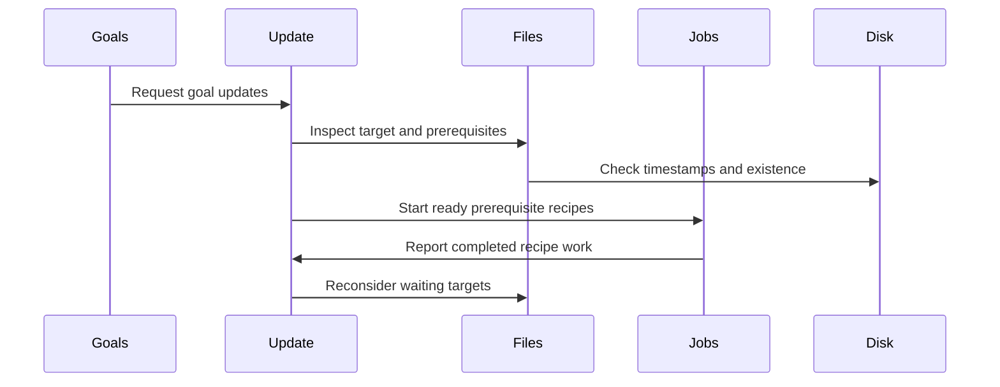

# Chapter 8: update_goal_chain

You run:

```sh
make app
```

and Make appears to do something simple:

```text
compile main.c
compile util.c
link app
```

But before it can authorize even the first compile command, Make must answer a long chain of questions:

- Does `app` exist?
- Are `main.o` or `util.o` newer than `app`?
- Can either object be built by an implicit rule?
- Are their source files available?
- Is another target already building the same file?
- Is there a circular dependency?
- Are prerequisite jobs still running?
- Does `-q`, `-n`, `-t`, or `-B` change the answer?
- Is this a normal build target, or a Makefile that must be remade before parsing can continue?

This is the work coordinated by `update_goal_chain()` in `src/remake.c`.

It is the point where GNU Make stops merely *describing* a build graph and starts *managing* it.

The parser has already turned Makefile text into [`struct file`](05_struct_file.md) nodes and [`struct dep`](06_struct_dep.md) edges. Implicit-rule search has supplied recipes where possible through [`struct rule`](07_struct_rule.md). Now `update_goal_chain()` repeatedly walks that network, waits for unfinished work, and authorizes recipes only when their prerequisites are ready.

Think of it as a project manager with a large whiteboard:

```text
app depends on main.o and util.o
main.o depends on main.c
util.o depends on util.c
```

The manager does not tell every worker to start immediately. First they inspect the work orders, check which materials are already available, notice blocked tasks, and start only the work that is necessary.

## Where the goal chain comes from

A command-line target becomes a `struct goaldep`.

When you invoke:

```sh
make app test
```

`main.c` treats `app` and `test` as requested goals. It creates file records, then links goal records together:

```c
lastgoal = alloc_goaldep ();
lastgoal->file = f;
```

Conceptually, Make now holds:

```text
goals
 ├── app
 └── test
```

A `struct goaldep` begins with the same common fields as a normal dependency:

```c
struct goaldep
  {
    DEP (struct goaldep);
    int error;
    floc floc;
  };
```

That shared layout lets GNU Make use much of the same list-handling logic for both:

- a target’s ordinary prerequisites;
- the top-level targets requested by the user;
- Makefiles that may need rebuilding.

The dependency record itself was covered in [struct dep](06_struct_dep.md). The important distinction is:

```text
struct dep      means one target needs one prerequisite
struct goaldep  means Make should try to update this top-level target
```

A goal is like the top item on a project manager’s agenda. It is not necessarily a file that already exists, but it is the work item the user asked Make to resolve.

## The central loop

Here is the opening shape of `update_goal_chain()`:

```c
enum update_status
update_goal_chain (struct goaldep *goaldeps)
{
  unsigned long last_cmd_count = 0;
  enum update_status status = us_none;
```

The function receives the goal chain and returns one overall status:

| Result | Meaning |
|---|---|
| `us_success` | Goals were handled successfully |
| `us_none` | No target required an action |
| `us_question` | `-q` found work that would be needed |
| `us_failed` | A target could not be updated |

The detailed meanings of these states live in [`struct file`](05_struct_file.md), where each target has its own `update_status`.

Before it starts walking, Make duplicates the goal chain:

```c
struct dep *goals_orig = copy_dep_chain ((struct dep *)goaldeps);
struct dep *goals = goals_orig;
```

Why copy it?

Because the update loop removes goals as they finish. It should not destroy the original command-line goal list or makefile-rebuild list while doing so.

This is like making a working checklist from the master project plan. The manager can cross items off the working copy without erasing the original record.

## A pass-based scheduler, not one deep recursive call

At first, you might expect Make to process one goal completely before moving to the next:

```text
build app
then build test
then exit
```

That would work for a strictly serial build, but it would waste opportunities for parallel work.

Instead, `update_goal_chain()` makes repeated passes over unfinished goals.

At the beginning of a new batch, it increments:

```c
++considered;
```

Each [`struct file`](05_struct_file.md) stores the last scan number in its `considered` field. This gives Make a cheap “already inspected in this pass” marker.

Then the loop keeps working while unfinished goals remain:

```c
while (goals != 0)
  {
    start_waiting_jobs ();
    reap_children (last_cmd_count == command_count, 0);
```

Two actions happen before Make examines goals again:

1. `start_waiting_jobs()` tries jobs previously delayed by the load limit.
2. `reap_children()` notices completed recipe processes.

That second action is crucial. A goal may have been blocked because a prerequisite recipe was still running. Once that child process finishes, the next pass can see the new state and continue.

The build engine therefore behaves less like a recursive function that vanishes down one branch and more like a supervisor repeatedly walking the project board:

```text
inspect work
start ready tasks
wait for progress if needed
inspect again
```

## A goal remains until all of its work is finished

Within each pass, Make walks the current goal list:

```c
gu = goals;
while (gu != 0)
  {
    g = gu->shuf ? gu->shuf : gu;
    goal_dep = g;
```

The `shuf` link supports `--shuffle`, which may deliberately traverse goals or prerequisites in a different order. The original `next` chain stays intact; `shuf` provides an alternate route.

This feature is useful because accidental ordering assumptions are common in Makefiles. If a build works only because prerequisites happen to be visited left-to-right, the Makefile is incomplete.

For example, this is fragile:

```make
app: generated.h main.o
```

if `main.o` really requires `generated.h` but does not declare it.

The robust version makes the dependency explicit:

```make
main.o: generated.h
app: main.o
```

Shuffling is like rearranging a project manager’s stack of folders. A correct dependency graph should still produce the same result.

A goal is removed from the working list only when it is done:

```c
if (stop || !any_not_updated)
  {
    if (lastgoal == 0)
      goals = gu->next;
    else
      lastgoal->next = gu->next;
```

If some prerequisite work is still running, the goal stays in the list for another pass.

## Double-colon targets are separate work orders

A target with ordinary single-colon rules merges information:

```make
report: data.txt
report: format.txt
```

But double-colon rules are independent:

```make
report:: data.txt
	./make-data-report

report:: format.txt
	./make-format-report
```

`update_goal_chain()` handles that by walking every double-colon entry:

```c
for (file = g->file->double_colon ? g->file->double_colon : g->file;
     file != NULL;
     file = file->prev)
```

Each entry can have:

- its own prerequisites;
- its own recipe;
- its own stale decision.

The double-colon chain is stored in `struct file` fields such as `double_colon` and `prev`, introduced in [struct file](05_struct_file.md).

Think of ordinary rules as several notes merged into one work order. Double-colon rules are multiple separate work orders sharing one nameplate.

## Makefiles are goals too

Before Make updates normal user goals, `main()` may call:

```c
status = update_goal_chain (read_files);
```

Here, `read_files` is a goal chain of Makefiles that were read or included.

Why rebuild a Makefile?

Because generated dependency files are often included:

```make
-include main.d util.d
```

If `main.d` can be remade, Make should rebuild it, then restart so the new dependency information is parsed.

This mode is marked by:

```c
rebuilding_makefiles = 1;
```

When Make is remaking Makefiles, it temporarily disables some ordinary user-request behaviors for Makefiles that were not explicit command-line goals:

```c
touch_flag = question_flag = just_print_flag = 0;
```

That prevents strange cases such as:

```sh
make -n
```

from merely printing the recipe for a missing included dependency file, then continuing with an incomplete graph.

A generated included Makefile is like a planning document that must be refreshed before the project manager can trust the rest of the plan.

If a Makefile actually changes, `main()` re-execs Make so parsing begins again with current information.

## `update_file()` avoids repeated work

For each requested goal, `update_goal_chain()` calls:

```c
fail = update_file (file, rebuilding_makefiles ? 1 : 0);
```

`update_file()` is a wrapper around the more detailed `update_file_1()`.

Its first responsibility is pruning repeated graph walks:

```c
if (f->considered == considered)
  {
    DBF (DB_VERBOSE, _("Pruning file '%s'.\n"));
    return f->command_state == cs_finished
      ? f->update_status : us_success;
  }
```

Suppose two goals share a prerequisite:

```make
app: common.o
tests: common.o
```

Make should not start two builds of `common.o`.

The `considered` counter says, “this file has already been inspected during the current pass.” The `command_state` says whether it has finished or is still running.

This is like a manager putting today’s date on a task card. If they encounter the same card again before the next review cycle, they know not to restart the investigation.

## The first question: does the target exist?

Inside `update_file_1()`, Make begins by checking the target’s timestamp:

```c
this_mtime = file_mtime (file);
check_renamed (file);

noexist = this_mtime == NONEXISTENT_MTIME;
```

`file_mtime()` obtains or reuses the cached modification time. It can also search through VPATH and update the file record if a different path is found.

The timestamp system, including special values such as `NONEXISTENT_MTIME`, was introduced in [struct file](05_struct_file.md).

For a normal file target, the first decision is straightforward:

```text
target exists       compare prerequisites against it
target missing      it probably must be remade
```

So Make initializes:

```c
must_make = noexist;
```

A missing target starts out stale.

That is the project-manager equivalent of seeing an empty delivery slot: if the requested product is absent, some action will be needed unless the target is only a bookkeeping name with no recipe.

## Grouped targets are only complete when peers exist

A grouped target recipe can promise several outputs:

```make
parser.c parser.h &: parser.y
	bison -d -o parser.c parser.y
```

If Make is asked for `parser.c`, it must not consider the grouped operation complete if `parser.h` is missing.

`update_file_1()` checks each `also_make` peer:

```c
for (ad = file->also_make; ad && !noexist; ad = ad->next)
  {
    FILE_TIMESTAMP fmtime = file_mtime (ad->file);
    noexist = fmtime == NONEXISTENT_MTIME;
```

If a peer is missing, the primary target must be remade too.

If all peers exist, Make uses the oldest peer timestamp as the group’s effective timestamp. That means an older peer can make the grouped operation stale.

It is like a package shipment containing two required items. The shipment is not complete merely because one box arrived.

## Implicit rules are requested only when needed

A target might have no explicit recipe:

```make
app: main.o
```

If Make is considering `main.o`, it may need to find a pattern rule such as:

```make
%.o: %.c
	$(CC) -c $< -o $@
```

The update engine asks for that only when appropriate:

```c
if (!file->phony && file->cmds == 0 && !file->tried_implicit)
  {
    try_implicit_rule (file, depth);
    file->tried_implicit = 1;
  }
```

This means:

- do not search implicit rules for phony targets;
- do not search if the file already has commands;
- do not repeat an expensive search unnecessarily.

The search process itself belongs to [struct rule](07_struct_rule.md). Once it succeeds, the target’s file record receives a concrete recipe, dependencies, and a stem.

The update engine’s job is not to understand every pattern-matching detail. It asks the rule subsystem for a viable build plan, then manages that concrete plan.

## Walking prerequisites before authorizing the target

After determining the target’s current state, Make walks its dependencies.

The core shape is:

```c
du = ad->file->deps;

while (du)
  {
    d = du->shuf ? du->shuf : du;
```

Each `d` is a [`struct dep`](06_struct_dep.md) edge. It may be:

- normal;
- order-only;
- deferred for secondary expansion;
- part of a `.WAIT` barrier;
- an inferred intermediate prerequisite.

Before Make uses dependencies, it performs secondary expansion when enabled:

```c
if (second_expansion)
  expand_deps (ad->file);
```

That function resolves prerequisite text that was intentionally deferred, such as:

```make
.SECONDEXPANSION:
app: $$(objects_for_$@)
```

At this point, Make knows the actual target and can provide automatic variables and target-specific variables during expansion.

The delayed-expansion mechanism was covered in [struct dep](06_struct_dep.md).

## Cycle detection: do not walk back into an active task

Consider this Makefile:

```make
a: b
b: a
```

Without protection, Make would recurse forever:

```text
a needs b
b needs a
a needs b
...
```

Before descending through a dependency, Make checks:

```c
if (is_updating (d->file))
  {
    OSS (error, NILF, _("Circular %s <- %s dependency dropped."),
         file->name, d->file->name);
```

The `updating` bit means that Make is currently walking that target’s dependency path.

If it finds a cycle, Make removes the circular edge from the active dependency chain and continues:

```c
if (lastd == 0)
  file->deps = du->next;
else
  lastd->next = du->next;
```

The wording “dependency dropped” matters. Make does not magically solve the circular relationship. It warns, breaks the loop, and proceeds with the remaining graph.

A cycle is like a manager reading:

```text
Task A cannot start until Task B finishes.
Task B cannot start until Task A finishes.
```

Neither task can be scheduled honestly. The only way to continue is to discard one circular claim and report the problem.

Double-colon targets use a shared root entry for this check, so distinct `::` rules for the same name do not evade cycle detection.

## Parent links explain useful error messages

Before Make recursively checks a prerequisite, it records:

```c
d->file->parent = file;
```

If a prerequisite cannot be made, this relationship lets Make report a useful chain:

```text
No rule to make target 'missing.h', needed by 'main.o'.
```

rather than only:

```text
No rule to make target 'missing.h'.
```

The `parent` field also supports target-specific variable inheritance, described in [variable_set_list](02_variable_set_list.md).

The parent link is like writing “requested by main.o” at the top of a missing-materials form.

## Normal and order-only prerequisites affect staleness differently

Each prerequisite is checked through:

```c
new = check_dep (d->file, depth, this_mtime, &maybe_make);
```

`check_dep()` recursively updates the prerequisite if necessary and can set `maybe_make` if the prerequisite is missing or newer than the current target.

Then `update_file_1()` applies the edge policy:

```c
if (! d->ignore_mtime)
  must_make = maybe_make;
```

This one condition is the heart of order-only prerequisites.

For:

```make
app: main.o | build
```

Make must ensure both `main.o` and `build` are ready. But only `main.o` participates in the timestamp decision.

| Prerequisite | Must exist first | Can remake `app` when newer |
|---|---:|---:|
| `main.o` | yes | yes |
| `build` | yes | no |

The `ignore_mtime` flag belongs to `struct dep`, covered in [struct dep](06_struct_dep.md).

An order-only prerequisite is like requiring a workshop to be unlocked before construction begins. The fact that someone recently opened the door does not mean the product must be rebuilt.

## `.WAIT` pauses traversal at a dependency barrier

A dependency list can include a local scheduling barrier:

```make
all: first second .WAIT third fourth
```

The dependency after `.WAIT` has `wait_here` set.

During traversal, Make checks:

```c
if (d->wait_here && running)
  break;
```

If earlier prerequisites are still running, Make stops scanning beyond the barrier for now.

This gives Make a staged schedule:

```text
first and second may run
wait for them
third and fourth may run
```

It does not disable parallelism everywhere. It adds one gate to one prerequisite list.

Like a factory checkpoint, work before the gate may proceed together, but work after the gate waits for inspection approval.

## Intermediate files are treated cautiously

An implicit rule may discover an intermediate file:

```text
app ← app.o ← app.c
```

Make does not always build intermediates immediately.

The update engine first examines non-intermediate prerequisites. Only after it knows the parent target really needs rebuilding does it revisit intermediate prerequisites:

```c
if (must_make || always_make_flag)
  {
    for (du = file->deps; du != 0; du = du->next)
      {
        if (d->file->intermediate)
          update_file (d->file, depth);
```

Why wait?

Because Make may discover that the final target is already current. In that case, building a missing intermediate solely because an implicit chain exists would be wasted work.

Imagine a manager who knows how to manufacture a temporary mold but does not authorize mold production until they know a new final product is actually required.

The intermediate-file policies—`intermediate`, `secondary`, and `notintermediate`—are part of [struct file](05_struct_file.md).

## Prerequisites can be running, not simply done or not done

The dependency walk tracks:

```c
int running = 0;
```

After considering a prerequisite, Make checks its command state:

```c
running |= (f->command_state == cs_running
            || f->command_state == cs_deps_running);
```

If any prerequisite recipe is still active, Make cannot yet decide whether the current target’s recipe may start.

Instead it records:

```c
set_command_state (file, cs_deps_running);
```

and returns without starting the target recipe.

On a later outer pass:

1. `reap_children()` notices finished prerequisite jobs.
2. `update_goal_chain()` revisits the unfinished goal.
3. `update_file_1()` sees that prerequisites are no longer running.
4. It can make a final stale decision.

This is the key to parallel builds. Make does not block the entire program waiting for one prerequisite. It starts available work, marks dependent targets as waiting, and revisits them after child jobs complete.



The job-management details are the subject of [new_job](09_new_job.md). In this chapter, the important point is that `update_goal_chain()` is the coordinator that keeps returning to work once its blockers disappear.

## Recording which prerequisites changed

Once no dependency recipes are running and no prerequisite failed, Make computes change information:

```c
deps_changed = 0;

for (d = file->deps; d != 0; d = d->next)
  {
    FILE_TIMESTAMP d_mtime = file_mtime (d->file);
```

For normal prerequisites, Make accumulates whether any changed:

```c
if (! d->ignore_mtime)
  deps_changed |= d->changed;
```

Then it updates the individual dependency’s `changed` bit:

```c
d->changed |= noexist || d_mtime > this_mtime;
```

That bit later feeds automatic variables such as `$?`.

For:

```make
app: main.o util.o
	@echo changed inputs are $?
```

if only `main.o` was rebuilt or is newer, `$?` becomes:

```text
main.o
```

The code that constructs `$?`, `$^`, `$+`, and `$|` lives in `set_file_variables()` in `src/commands.c`, introduced in [struct dep](06_struct_dep.md).

The update engine gathers the facts; the recipe-expansion layer later turns those facts into useful text.

## The final stale decision

After checking prerequisites, Make applies several special rules.

### Double-colon target with no prerequisites

A double-colon target with no prerequisites is always remade:

```c
if (file->double_colon && file->deps == 0)
  {
    must_make = 1;
```

This matches the idea that an independent `::` rule is an action that should run whenever Make considers it.

### Target with no recipe and unchanged prerequisites

A declared target without commands does not necessarily require work:

```c
else if (!noexist && file->is_target && !deps_changed
         && file->cmds == 0 && !always_make_flag)
  {
    must_make = 0;
```

For example:

```make
all: app
```

`all` often has no recipe. If `app` is current, `all` does not need a recipe of its own.

### The always-make flag

With:

```sh
make -B app
```

Make forces rebuilding:

```c
else if (!must_make && file->cmds != 0 && always_make_flag)
  {
    must_make = 1;
```

This is the project manager receiving a direct instruction: “Redo this work even if the usual inspection says it is current.”

## When no rebuild is needed

If Make decides the target is current:

```c
if (!must_make)
  {
    notice_finished_file (file);
    return us_success;
  }
```

`notice_finished_file()` marks the file as finished and updates bookkeeping.

Make may print one of two familiar messages:

```text
'app' is up to date.
```

or:

```text
Nothing to be done for 'clean'.
```

The distinction depends partly on whether the target has a recipe and whether it is phony.

For a file that Make did not create during this run, it also protects against accidental intermediate deletion:

```c
file->secondary = 1;
```

This says, in effect, “we found this file already present; do not later treat it as disposable temporary output.”

## When a rebuild is needed

If the target is stale, Make reaches:

```c
DBF (DB_BASIC, _("Must remake target '%s'.\n"));

remake_file (file);
```

`remake_file()` decides what kind of action is possible.

If there is no recipe:

```c
if (file->cmds == 0)
  {
    if (file->phony)
      file->update_status = us_success;
```

A phony target succeeds without creating a filesystem file:

```make
.PHONY: clean
clean:
	rm -f *.o app
```

If an ordinary declared target has no recipe, Make can also treat it as successfully handled in some situations. But if an undeclared dependency file is missing and cannot be made, Make reports failure.

If commands exist, Make prepares them:

```c
chop_commands (file->cmds);
execute_file_commands (file);
```

This is the handoff from build decision to recipe execution.

The update engine says:

```text
This task is necessary and its prerequisites are ready.
```

The job system then says:

```text
Here is how to expand, launch, monitor, and finish its commands.
```

## Question mode, dry-run mode, and touch mode

Several command-line options alter what “update” means.

### `-q`: question mode

With:

```sh
make -q app
```

Make must not run normal recipes. Instead, it returns `us_question` when it discovers that work would be needed.

The outer goal loop notices this status and can stop early:

```c
stop = (question_flag && !keep_going_flag
        && !rebuilding_makefiles);
```

This is like asking a manager, “Would this project require work?” rather than “Please perform the work.”

### `-n`: dry-run mode

With:

```sh
make -n app
```

Make prints commands but normally does not execute them. The decision engine still performs dependency analysis because it must know which commands *would* run.

### `-t`: touch mode

With:

```sh
make -t app
```

Make updates timestamps instead of running ordinary recipes where appropriate.

The actual touch operation occurs later in `touch_file()`, but `update_goal_chain()` still makes the same stale decision first.

These modes do not replace the dependency engine. They change what happens after the engine authorizes a target.

## Updating status after recipes finish

A recipe may finish immediately in serial mode, or later in a parallel build.

When the job system reaps a completed child process, it calls:

```c
notice_finished_file (c->file);
```

That function marks:

```c
file->command_state = cs_finished;
file->updated = 1;
```

It may refresh timestamps, propagate results to grouped peer targets, and convert an untouched successful status into `us_success`.

Then, on the next scheduler pass, `update_goal_chain()` sees that a previously waiting target can continue.

This separation is important:

| Component | Main responsibility |
|---|---|
| `update_goal_chain()` | Revisit goals and decide what may proceed |
| `update_file_1()` | Inspect one target and its prerequisites |
| `remake_file()` | Choose how to handle a stale target |
| `execute_file_commands()` | Prepare recipe context |
| `new_job()` | Start and manage command execution |
| `reap_children()` | Record recipe completion |

A construction manager should not also be the person operating every machine. GNU Make follows the same division of responsibility.

## A full walk-through

Consider this Makefile:

```make
.PHONY: all
all: app

app: main.o util.o | build
	$(CC) -o $@ $^

build:
	mkdir -p $@
```

Assume:

```text
main.c exists
util.c exists
main.o missing
util.o missing
app missing
build missing
```

The update process unfolds approximately like this.

### 1. Start with `all`

`all` is phony, so Make knows it should be considered even though no real `all` file exists.

It depends on `app`.

### 2. Inspect `app`

`app` is missing:

```text
must_make = yes
```

It has three prerequisites:

```text
main.o
util.o
build order-only
```

### 3. Find recipes for object files

`main.o` and `util.o` have no explicit recipes, so Make searches implicit rules.

The built-in or user-defined rule:

```make
%.o: %.c
	$(CC) -c $< -o $@
```

provides plans for both objects.

That implicit-rule selection is covered in [struct rule](07_struct_rule.md).

### 4. Start ready prerequisite jobs

Make can start:

```text
compile main.c
compile util.c
mkdir build
```

depending on job limits and `.WAIT` barriers.

At this moment, `app` cannot link yet, because its prerequisites are still running.

Its state becomes:

```text
command_state: dependencies running
```

### 5. Reap completed jobs and revisit

The outer `update_goal_chain()` loop waits as needed, reaps completed child processes, and revisits unfinished goals.

Once all three prerequisites finish:

- `main.o` changed;
- `util.o` changed;
- `build` may have changed, but it is order-only.

### 6. Decide that `app` must link

Because `app` is missing, and its normal prerequisites are now available, Make authorizes its recipe.

Before expansion, Make sets automatic variables:

```text
$@ = app
$^ = main.o util.o
$| = build
```

Then the job subsystem runs the link command.

### 7. Finish the phony `all` target

`all` has no recipe of its own. Once `app` is complete, Make marks `all` successfully handled.

The project manager’s checklist is now empty.

## Debugging the update process

GNU Make’s debug modes are particularly useful for understanding this layer.

To see basic rebuild reasoning:

```sh
make --debug=b app
```

Typical messages include:

```text
Considering target file 'app'.
File 'app' does not exist.
Prerequisite 'main.o' is newer than target 'app'.
Must remake target 'app'.
```

To include implicit-rule searching:

```sh
make --debug=i app
```

To see detailed decisions, including pruning and job behavior:

```sh
make -d app
```

Useful questions to ask while reading debug output are:

1. Did Make think the target existed?
2. Which prerequisite made it stale?
3. Did Make find an implicit recipe?
4. Is the target waiting because prerequisite jobs are running?
5. Was a prerequisite order-only?
6. Did Make detect a cycle?
7. Did `-B`, `-q`, `-n`, or `-t` alter the final action?

The output can be verbose, but it mirrors the project-manager process described in this chapter.

## Reading the source without getting lost

These functions form a useful map:

| Question | Main location |
|---|---|
| Where are all requested goals managed? | `update_goal_chain()` in `src/remake.c` |
| Where is one target considered? | `update_file()` and `update_file_1()` in `src/remake.c` |
| Where are prerequisites recursively checked? | `check_dep()` in `src/remake.c` |
| Where is stale status decided? | `update_file_1()` in `src/remake.c` |
| Where are recipes authorized? | `remake_file()` in `src/remake.c` |
| Where are command lines prepared? | `execute_file_commands()` in `src/commands.c` |
| Where are recipes launched? | `new_job()` in `src/job.c` |
| Where are completed recipes recorded? | `reap_children()` in `src/job.c` |
| Where are automatic variables set? | `set_file_variables()` in `src/commands.c` |
| Where are timestamps read? | `f_mtime()` in `src/remake.c` |
| Where are implicit recipes found? | `try_implicit_rule()` in `src/implicit.c` |

A good orientation question is:

> Is Make still deciding whether work is necessary, or has it already started a recipe?

If it is deciding, you are usually in `update_goal_chain()`, `update_file_1()`, or `check_dep()`. If work has already been authorized, control is moving toward `execute_file_commands()` and `new_job()`.

## Key takeaways

`update_goal_chain()` is GNU Make’s top-level build scheduler.

It does not simply recurse through dependencies once. Instead, it repeatedly:

1. walks unfinished requested goals;
2. checks for completed child processes;
3. starts work that is now ready;
4. leaves blocked goals in the queue;
5. revisits those goals after prerequisite work finishes;
6. returns an overall success, failure, or question-mode result.

Its decisions are based on information collected by earlier subsystems:

- [`struct file`](05_struct_file.md) provides target state, timestamps, recipes, flags, and command lifecycle;
- [`struct dep`](06_struct_dep.md) provides prerequisite edges, order-only behavior, `.WAIT`, and changed status;
- [`struct rule`](07_struct_rule.md) provides reusable implicit recipes when no explicit recipe exists;
- [variable_set_list](02_variable_set_list.md) and [variable_expand](03_variable_expand.md) provide the target-aware variable context later used to expand recipes.

The most important mental model is this:

> GNU Make does not start a recipe merely because it sees one. It starts a recipe only after the dependency manager has established that the target is stale and its prerequisites are ready.

Now that the manager has authorized a target’s work, the next question is what happens to its recipe text: how Make expands it, chooses a shell, creates a child process, tracks output, and handles success or failure. That is the subject of [new_job](09_new_job.md).