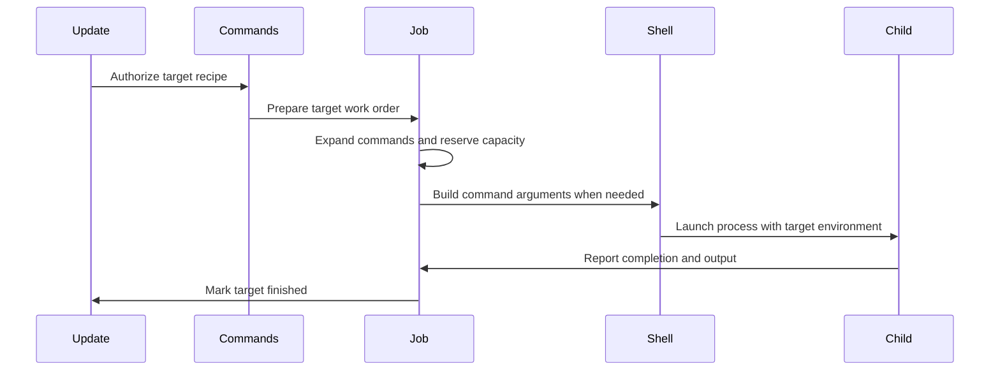

# Chapter 9: new_job

You have reached the moment when Make has decided a target needs work.

For example:

```make
app: main.o util.o
	$(CC) -o $@ $^
```

By now, Make has already answered difficult questions:

- `app` is missing or out of date;
- `main.o` and `util.o` are ready;
- the recipe belongs to `app`;
- `$@` should mean `app`;
- `$^` should mean `main.o util.o`.

But none of that has run a command yet.

How does Make turn the stored recipe text into a real running process? How does it avoid exceeding `make -j4` limits? How can parallel commands avoid mixing their output together? Why does `echo hello` sometimes run without a shell, while `echo *.c` requires one?

The answer begins with `new_job()` in `src/job.c`.

Think of `new_job()` as a dispatch desk. The dependency engine has approved a work order. Now the dispatch desk must:

1. prepare the instructions;
2. assign the right target-specific workspace;
3. wait for a worker slot if necessary;
4. decide whether the worker needs a shell;
5. launch the work;
6. keep enough records to inspect the result later.

The target and dependency decision was made by [update_goal_chain](08_update_goal_chain.md). This chapter follows the handoff from “this target must be rebuilt” to “a child process is running.”

## The handoff from the dependency engine

Once Make decides a recipe should run, `remake_file()` calls:

```c
chop_commands (file->cmds);
execute_file_commands (file);
```

`execute_file_commands()` first prepares target-specific variables and automatic variables:

```c
initialize_file_variables (file, 0);
set_file_variables (file, file->stem);
```

This gives the target a local variable world containing values such as:

```text
$@  app
$<  main.o
$^  main.o util.o
$?  prerequisites that changed
```

The details of those variable scopes belong to [variable_set_list](02_variable_set_list.md), and the automatic-variable lists come from [struct dep](06_struct_dep.md).

Then `execute_file_commands()` calls:

```c
new_job (file);
```

At that point, Make has a `struct file` with a recipe, dependencies, timestamps, and update state. The file record was introduced in [struct file](05_struct_file.md).

The job system receives the completed work order.

## A child record keeps the job alive

A recipe may involve more than one command line:

```make
app:
	@echo compiling
	$(CC) -o $@ main.o
	@echo finished
```

Make needs to remember which line is currently running, what environment the child received, whether errors are ignored, and whether the process has finished.

That information lives in `struct child`:

```c
struct child
  {
    CHILDBASE;
    struct child *next;
    struct file *file;
    char **command_lines;
```

```c
    char *command_ptr;
    unsigned int command_line;
    pid_t pid;
```

The important fields are:

| Field | Meaning |
|---|---|
| `file` | The target being rebuilt |
| `command_lines` | Expanded recipe lines |
| `command_ptr` | Current position within the active line |
| `command_line` | Index of the current recipe line |
| `pid` | Operating-system process identifier |
| `environment` | Environment passed to child commands |
| `output` | Output-capture state |
| `next` | Link to other active jobs |

A `struct child` is Make’s clipboard for an active work order. The shell or compiler has its own process state in the operating system, but Make keeps its own record so it can continue the recipe after one command finishes.

## Splitting a recipe into logical command lines

The parser stores recipe text in one `struct commands` object. Before it can run commands one by one, Make calls `chop_commands()`.

```c
if (!cmds || cmds->command_lines != NULL)
  return;
```

This means recipe splitting happens only once. If a recipe was already chopped into lines, Make reuses the result.

Normally, each unescaped newline becomes one command line:

```make
demo:
	echo first
	echo second
```

Conceptually, Make stores:

```text
command line 0: echo first
command line 1: echo second
```

A backslash followed by newline keeps lines together:

```make
demo:
	echo first \
	     second
```

That becomes one logical command line.

The distinction matters because ordinary recipes usually run each line in a separate shell process:

```make
bad:
	cd build
	pwd
```

The second line usually runs in a fresh shell, so `pwd` does not see the earlier `cd`.

Use one shell command line instead:

```make
good:
	cd build && pwd
```

Or request `.ONESHELL`:

```make
.ONESHELL:
good:
	cd build
	pwd
```

With `.ONESHELL`, `chop_commands()` intentionally creates one command entry containing the whole recipe:

```c
if (one_shell)
  {
    nlines = 1;
    lines[0] = xstrdup (cmds->commands);
  }
```

This is like the difference between giving each instruction to a different worker versus handing an entire checklist to one worker.

## Recipe prefixes become flags

Recipe lines can begin with special prefixes:

```make
demo:
	@echo quiet
	-false
	+$(MAKE) -C subdir
```

The parser records their meaning in `lines_flags`.

```c
while (ISBLANK (*p) || *p == '-' || *p == '@' || *p == '+')
  switch (*(p++))
```

The flags are:

| Prefix | Internal meaning | User-visible behavior |
|---|---|---|
| `@` | `COMMANDS_SILENT` | Do not print the command before running it |
| `-` | `COMMANDS_NOERROR` | Ignore a failing exit status |
| `+` | `COMMANDS_RECURSE` | Treat as a recursive Make command |

Make also recognizes `$(MAKE)` or `${MAKE}` as recursive even without `+`:

```c
if (strstr (p, "$(MAKE)") != 0 || strstr (p, "${MAKE}") != 0)
  flags |= COMMANDS_RECURSE;
```

That matters for options such as `-n`, `-t`, and parallel execution. Recursive Make commands are special because they may need to run even in modes where ordinary commands are only printed or skipped.

For example:

```make
all:
	$(MAKE) -C library
```

Make recognizes that this is not just an arbitrary shell line. It is another Make invocation, potentially participating in the larger build.

The next chapter, [jobserver](10_jobserver.md), explains how recursive Make processes share parallel-job capacity safely.

## `new_job()` creates a dispatch record

The beginning of `new_job()` is deliberately practical:

```c
void
new_job (struct file *file)
{
  struct commands *cmds = file->cmds;
  struct child *c;
```

Before starting the new work, Make gives old waiting work a chance:

```c
start_waiting_jobs ();
reap_children (0, 0);
```

These calls mean:

- start jobs delayed by the load-average limit if conditions improved;
- collect status from children that have already finished.

This is good dispatch-desk behavior. Before assigning a new worker, check whether workers have returned or delayed jobs can finally leave the queue.

Then Make ensures the recipe has been split:

```c
chop_commands (cmds);
```

Finally it allocates a child record:

```c
c = xcalloc (sizeof (struct child));
output_init (&c->output);

c->file = file;
c->sh_batch_file = NULL;
```

The `xcalloc()` call gives Make a blank clipboard: null pointers, zero flags, no process ID, and no reserved job slot.

Make also saves `dontcare`:

```c
c->dontcare = file->dontcare;
```

This is important because the file’s `dontcare` value can change while the job is running. The child needs to remember whether its failure should produce a normal diagnostic.

## Recipe expansion happens before launching

A stored recipe line may still contain Make syntax:

```make
app:
	$(CC) $(CFLAGS) -o $@ $^
```

Before Make can launch anything, it expands each recipe line.

```c
lines = xmalloc (cmds->ncommand_lines * sizeof (char *));
for (i = 0; i < cmds->ncommand_lines; ++i)
  {
    lines[i] = allocated_variable_expand_for_file (
      cmds->command_lines[i], file);
  }
```

The real source includes extra handling for backslash-newline sequences inside variable and function references, but the essential action is the final call:

```c
allocated_variable_expand_for_file (cmds->command_lines[i], file);
```

That function activates the target’s variable scope and expands the line. The expansion process is explained in [variable_expand](03_variable_expand.md).

For the `app` recipe, Make might produce:

```sh
cc -O2 -o app main.o util.o
```

The expanded strings are stored in `child->command_lines`, not immediately discarded. Make may need them later because recipes can contain several commands.

This is an important timing point:

```text
stored recipe text
    ↓
target-aware Make expansion
    ↓
expanded command lines
    ↓
shell or direct process execution
```

The shell never receives `$(CC)` or `$@`. Those belong to Make’s language and are resolved before process creation.

## Output generated during expansion belongs to the job

Expansion can have visible side effects:

```make
app:
	$(info preparing $@)
	$(CC) -o $@ $^
```

The `info` function writes output while Make expands the recipe, before the compiler process starts.

`new_job()` sets the output context before expansion:

```c
OUTPUT_SET (&c->output);
```

This means output generated while expanding the command lines can be captured or synchronized with the rest of the job’s output.

Without this step, parallel output synchronization would have a hole: compiler output might stay grouped, but messages created by `$(info ...)` during recipe expansion could appear elsewhere.

Think of it as attaching a folder to the work order before anyone starts writing notes into it.

## Selecting the first command

Once all lines are expanded, Make asks `job_next_command()` for the first runnable command:

```c
job_next_command (c);
```

That helper advances through empty command lines and tracks which line is current.

```c
while (child->command_ptr == 0 || *child->command_ptr == '\0')
  {
    if (child->command_line == child->file->cmds->ncommand_lines)
      return 0;
```

A recipe can contain lines that expand to nothing:

```make
OPTIONAL =
demo:
	$(OPTIONAL)
	echo real work
```

After expansion, the first line is empty. Make does not launch a useless shell for it; it moves to the next command.

The child record tracks both:

```text
command_line   which recipe line Make is on
command_ptr    where Make is within that expanded line
```

The second field matters because one expanded recipe line can contain multiple shell-command segments in some platform-specific situations.

## Job slots: do we have room to run?

Before Make launches a child, it must observe the configured parallelism limit.

For ordinary non-jobserver operation, `new_job()` checks:

```c
if (job_slots != 0)
  while (job_slots_used == job_slots)
    reap_children (1, 0);
```

The relevant global counters are:

```text
job_slots       maximum local parallel jobs
job_slots_used  currently occupied slots
```

For example:

```sh
make -j4
```

means Make should permit up to four running jobs.

If all four slots are in use, Make blocks in `reap_children(1, 0)` until some running child exits. Reaping that child frees a slot.

This is like a workshop with four workbenches:

```text
four benches occupied
    ↓
new work order arrives
    ↓
wait until one worker finishes
    ↓
assign the freed bench
```

When GNU Make is using the jobserver, `job_slots` is zero and a different token-based system controls capacity. `new_job()` contains the handoff to that system, but the details deserve their own discussion in [jobserver](10_jobserver.md).

## A jobserver token is a portable worker permit

When the jobserver is enabled, Make obtains a token before starting another child:

```c
else if (jobserver_enabled ())
  while (1)
    {
      int got_token;
      ...
      got_token = jobserver_acquire (waiting_jobs != NULL);
```

Each token represents permission to run one additional job.

The code also recognizes one special case:

```c
if (!jobserver_tokens)
  break;
```

Every Make process effectively has one “free” job it may run without reading a token. This prevents a recursive Make from immediately deadlocking while trying to acquire permission to do its first useful task.

After permission has been arranged, `new_job()` records:

```c
++jobserver_tokens;
```

Later, when the child is freed, Make gives the token back if appropriate.

For now, the key connection is:

```text
new_job asks for permission
    ↓
a child starts
    ↓
child completion returns permission
```

That makes parallelism work across recursive Make processes, not merely within one process.

## Trace output explains why a target runs

With `--trace` or suitable debug flags, Make can explain why it is rebuilding a target.

Inside `new_job()`, Make checks:

```c
if (ISDB (DB_WHY))
  {
    ...
  }
```

It may report that a target is being updated because:

- it is phony;
- it does not exist;
- normal prerequisites changed;
- prerequisites remain missing.

For changed prerequisites, it expands `$?`:

```c
char *newer = allocated_variable_expand_for_file ("$?", c->file);
```

That ties together several chapters:

- [struct dep](06_struct_dep.md) records `dep->changed`;
- [update_goal_chain](08_update_goal_chain.md) decides which dependencies changed;
- `set_file_variables()` turns that information into `$?`;
- `new_job()` uses `$?` to explain the rebuild.

A command such as:

```sh
make --trace app
```

can therefore report a reason close to the actual internal decision.

## Starting a command: prefixes and policy meet

`start_waiting_job()` eventually calls:

```c
start_job_command (c);
```

This is where Make prepares one concrete command line.

The function combines target-wide and line-specific flags:

```c
flags = (child->file->command_flags
         | child->file->cmds->lines_flags[
             child->command_line - 1]);
```

Target-wide flags can come from special targets such as:

```make
.IGNORE: app
.SILENT: app
```

The line-specific flags came from recipe prefixes such as `@`, `-`, and `+`.

Then Make scans any prefixes that survived expansion:

```c
while (*p != '\0')
  {
    if (*p == '@')
      flags |= COMMANDS_SILENT;
```

```c
    else if (*p == '+')
      flags |= COMMANDS_RECURSE;
    else if (*p == '-')
      child->noerror = 1;
```

This second scan is necessary because variable expansion can introduce text beginning with prefix characters.

For example:

```make
QUIET = @
demo:
	$(QUIET)echo hello
```

The raw stored line does not visibly begin with `@`, but the expanded line does. Make therefore checks again after expansion.

The child record remembers two especially important results:

```c
child->noerror = ANY_SET (flags, COMMANDS_NOERROR);
child->recursive = ANY_SET (flags, COMMANDS_RECURSE);
```

Those values guide later behavior when the command exits.

## Dry runs and question mode stop before process creation

Not every command preparation leads to a real child process.

With `make -q`, Make asks whether work would be needed. Once it finds a real non-recursive command, it records a question result:

```c
if (argv != 0 && question_flag
    && NONE_SET (flags, COMMANDS_RECURSE))
  {
    child->file->update_status = us_question;
    notice_finished_file (child->file);
    return;
  }
```

With `make -n`, Make prints commands but generally does not execute ordinary ones:

```c
if (just_print_flag && NONE_SET (flags, COMMANDS_RECURSE))
  {
    FREE_ARGV (argv);
    goto next_command;
  }
```

Recursive commands are intentionally different. A line containing `+` or `$(MAKE)` may still execute under `-n`, because recursive Make is often needed to reveal or perform nested work correctly.

This gives a useful rule of thumb:

| Mode | Ordinary recipe line | Recursive recipe line |
|---|---|---|
| `-n` | print, do not execute | may execute |
| `-q` | report work needed | recursive behavior can propagate question status |
| `-t` | touch target instead | recursive lines may still run |

The dependency engine decides that work is needed; the job layer decides whether this invocation should actually launch it.

## Printing commands and synchronizing output

Before starting a real command, Make decides whether to print it:

```c
if (just_print_flag || ISDB (DB_PRINT)
    || (NONE_SET (flags, COMMANDS_SILENT) && !run_silent))
  OS (message, 0, "%s", p);
```

This accounts for:

- normal recipe echoing;
- `@` prefixes;
- global `-s`;
- dry-run output;
- debug printing.

Then Make configures output synchronization:

```c
child->output.syncout = output_sync
  && (output_sync == OUTPUT_SYNC_RECURSE
      || NONE_SET (flags, COMMANDS_RECURSE));
```

GNU Make supports options such as:

```sh
make -j4 --output-sync=target
```

Without output synchronization, parallel jobs can interleave:

```text
cc compiling main.c
cc compiling util.c
warning from util.c
linking app
```

With synchronization, Make captures output and emits it in larger coherent units.

The available modes include:

| Option | Intended grouping |
|---|---|
| `--output-sync=none` | Write output immediately |
| `--output-sync=line` | Keep each recipe line’s output together |
| `--output-sync=target` | Keep one target’s output together |
| `--output-sync=recurse` | Synchronize recursive Make output specially |

`new_job()` itself does not read every byte of child output. It initializes and selects the output policy. The process-launch code redirects standard output and standard error when needed, and `reap_children()` eventually calls:

```c
output_dump (&c->output);
```

Think of unsynchronized output as several people speaking into one room at once. Output synchronization gives each job a turn to hand over its transcript.

## Standard input: one child gets the real terminal

Parallel builds create a subtle problem: what if several recipe commands all try to read standard input?

GNU Make gives the real standard input to only one active child:

```c
child->good_stdin = !good_stdin_used;
if (child->good_stdin)
  good_stdin_used = 1;
```

Later children receive a deliberately unusable input source.

The helper `get_bad_stdin()` creates the read end of a broken pipe:

```c
if (pipe (pd) == 0)
  {
    close (pd[1]);
    bad_stdin = pd[0];
  }
```

Reading from that descriptor immediately reaches end-of-file.

This policy prevents several parallel compilers, scripts, or tools from competing for your terminal input.

It is like a meeting room with one microphone. The first speaker gets the microphone; everyone else receives a disconnected one instead of all talking over one another.

When the child that owns the real input finishes, `reap_children()` releases it:

```c
if (c->good_stdin)
  good_stdin_used = 0;
```

## Building the target environment

A child process receives more than command arguments. It also receives an environment.

For a recipe such as:

```make
export MODE = debug

app:
	@echo $$MODE
```

the shell must receive:

```text
MODE=debug
```

`start_job_command()` builds the environment the first time it needs one:

```c
if (child->environment == 0)
  child->environment = target_environment (
    child->file, child->file->cmds->any_recurse);
```

`target_environment()` walks the target’s visible variable scopes and collects exported variables.

```c
for (s = set_list; s != 0; s = s->next)
  {
    struct variable_set *set = s->set;
    ...
  }
```

The first visible definition wins, matching ordinary Make variable lookup. But private parent variables are excluded:

```c
if (!islocal && v->private_var)
  continue;
```

Then Make applies export policy:

```c
if (! should_export (v))
  continue;
```

The export rules were introduced in [struct variable](01_struct_variable.md). The target’s scope chain comes from [variable_set_list](02_variable_set_list.md).

For recursive exported variables, Make expands the final value:

```c
if (v->recursive
    && ((v->origin != o_env && v->origin != o_env_override)
        || streq (v->name, MAKEFLAGS_NAME)))
  value = cp = recursively_expand_for_file (v, file);
```

The child receives `NAME=value` strings:

```c
*result++ = xstrdup (concat (3, v->name, "=", value));
```

This means a recipe process gets a fresh, target-aware environment rather than blindly inheriting Make’s process environment unchanged.

## `MAKELEVEL` rises for child commands

When Make starts a child process, it increments `MAKELEVEL` in the child environment:

```c
sprintf (val, "%u", makelevel + 1);
value = cp = xstrdup (val);
```

This is why a recursive Make can detect its depth:

```make
show:
	@echo level is $$MAKELEVEL
```

A top-level Make process commonly sees level `0`. Its child commands see an incremented environment value, and a recursive `$(MAKE)` invocation uses that value as its own starting level.

This is like a project folder stamped with its nesting depth:

```text
top-level build
    ↓
submake
    ↓
nested submake
```

The level helps Make format diagnostics and distinguish recursive contexts.

## `MAKEFLAGS` carries parallel-job information

A recursive Make invocation needs to learn relevant options from its parent, including jobserver authorization.

`target_environment()` has special handling for `MAKEFLAGS` and `MFLAGS` when jobserver information must be invalidated for non-recursive commands.

The high-level reason is simple:

- recursive Make commands should receive valid jobserver access;
- arbitrary child commands should not accidentally inherit usable jobserver file descriptors;
- a submake that is not recognized as recursive must not believe it can consume parent job tokens.

The child-launch path reinforces this distinction:

```c
jobserver_pre_child (
  ANY_SET (flags, COMMANDS_RECURSE));
```

Then, after spawning:

```c
jobserver_post_child (
  ANY_SET (flags, COMMANDS_RECURSE));
```

For a recursive child, Make temporarily marks jobserver descriptors inheritable. For ordinary commands, those descriptors remain closed on exec.

This is a security-badge analogy:

```text
ordinary command receives no jobserver badge
recursive make receives a valid shared badge
```

The complete token protocol is the subject of [jobserver](10_jobserver.md).

## Direct execution versus shell execution

A beginner often hears:

> Make runs every recipe line through `/bin/sh`.

That is a useful approximation, but GNU Make can avoid the shell for simple commands.

Consider:

```make
demo:
	printf '%s\n' hello
```

There are no shell operators, redirects, pipelines, wildcards, variable expansions, or shell built-ins required. Make may execute `printf` directly.

But this requires a shell:

```make
demo:
	echo *.c
```

The `*.c` wildcard must be expanded by the shell.

This also requires a shell:

```make
demo:
	echo hello | sed 's/hello/hi/'
```

The pipe is shell syntax.

The decision begins in `construct_command_argv()`:

```c
argv = construct_command_argv_internal (
  line, restp, shell, shellflags, ifs,
  cmd_flags, batch_filename);
```

The internal function first tries a fast direct-execution path. It looks for shell-special characters:

```c
static const char *sh_chars =
  "#;\"*?[]&|<>(){}$`^~!";
```

If one appears outside safe quoting, Make gives up on direct parsing and uses the shell.

It also recognizes shell built-ins:

```c
static const char *sh_cmds[] =
  { ".", ":", "alias", "bg", "break", "case",
    "cd", "command", "continue", "eval", ... };
```

For example, `cd` must run in a shell because it changes a shell’s working directory:

```make
demo:
	cd build
```

Launching an external `cd` program would not make sense on normal Unix systems.

The direct path is like sending a package straight to a worker. The shell path is like sending it through an interpreter who understands pipes, redirections, wildcards, conditionals, and shell built-ins.

## The shell path constructs a shell command

When Make decides the shell is needed, it builds an argument list conceptually like:

```text
shell
shell flags
command text
```

For a normal Unix shell, that often becomes:

```sh
/bin/sh -c 'echo *.c'
```

The shell and flags are target-aware variables:

```c
shell = allocated_variable_expand_for_file (
  "$(SHELL)", file);
```

```c
shellflags = allocated_variable_expand_for_file (
  var->value, file);
```

The default `.SHELLFLAGS` value is usually:

```text
-c
```

In POSIX mode, Make may use:

```text
-ec
```

unless errors are explicitly ignored.

A target can even use target-specific shell settings:

```make
special: .SHELLFLAGS = -ec
special:
	false
	echo unreachable
```

Because `construct_command_argv()` uses `lookup_variable_for_file()`, it reads `.SHELLFLAGS` from the target’s variable context.

That is another example of the same scoped-variable machinery from [variable_set_list](02_variable_set_list.md) affecting a later subsystem.

## `.ONESHELL` changes what reaches the shell

Without `.ONESHELL`, Make typically invokes one shell per logical recipe line:

```make
demo:
	echo one
	echo two
```

Conceptually:

```text
shell process one runs echo one
shell process two runs echo two
```

With `.ONESHELL`:

```make
.ONESHELL:
demo:
	echo one
	echo two
```

Make passes the whole recipe as one script.

This matters for shell state:

```make
.ONESHELL:
demo:
	value=hello
	echo $$value
```

Now `value` remains set because both lines run in the same shell process.

GNU Make also removes interior `@`, `-`, and `+` prefixes for Bourne-compatible shells in `.ONESHELL` mode. Those prefixes are Make syntax, not meaningful shell syntax.

The code explains the intention:

```c
/* Remove and ignore interior prefix chars
   because they're meaningless given a single shell. */
```

A `.ONESHELL` recipe is like giving a worker a full script. A normal recipe is like giving separate workers separate index cards.

## Launching the actual child process

After Make has:

- selected a command;
- expanded it;
- built arguments;
- prepared the environment;
- configured output;
- selected standard input;
- obtained a job slot or token;

it is ready to create a process.

On POSIX-like systems, `child_execute_job()` performs the launch.

```c
pid = vfork ();
if (pid != 0)
  {
    environ = parent_env;
    return pid;
  }
```

The child side then redirects file descriptors when output synchronization or bad standard input is in use:

```c
if (fdin >= 0 && fdin != FD_STDIN)
  dup2 (fdin, FD_STDIN);
if (fdout != FD_STDOUT)
  dup2 (fdout, FD_STDOUT);
```

Finally it executes the command:

```c
exec_command (argv, child->environment);
_exit (127);
```

The exact mechanism can vary by platform:

- Unix-like systems may use `vfork()` and `exec`;
- builds configured for `posix_spawn()` may use that API;
- Windows uses process-launch support around `CreateProcess`;
- some platforms create temporary batch files.

But the contract stays the same:

```text
arguments
environment
standard input policy
output redirection
    ↓
new operating-system process
```

The `pid` returned from the operating system is stored in the child record.

## Make records the running child

Once the command starts, Make marks the target as running:

```c
set_command_state (child->file, cs_running);
```

It then links the child into the global active-child list:

```c
c->next = children;
children = c;
```

And it accounts for the occupied slot:

```c
++job_slots_used;
c->jobslot = 1;
```

The `command_state` field belongs to `struct file`:

```text
cs_not_started
cs_deps_running
cs_running
cs_finished
```

That state is what allows [update_goal_chain](08_update_goal_chain.md) to know that a target is blocked on active work rather than failed or complete.

The lifecycle looks like this:

```text
target needs remake
    ↓
new_job creates child record
    ↓
start_job_command launches process
    ↓
target state becomes running
    ↓
reap_children observes exit
    ↓
target state becomes finished
```

## Reaping children continues multi-line recipes

A child process finishing does not always mean the target’s recipe is complete.

Suppose:

```make
demo:
	echo first
	echo second
```

When the first shell exits successfully, `reap_children()` asks:

```c
if (job_next_command (c))
  {
    ...
    start_job_command (c);
  }
```

If another command remains, Make starts it using the same `struct child`.

This is why one child record represents a **recipe job**, not necessarily one operating-system process. A normal multi-line recipe may create several shell processes in sequence while retaining one Make-side child record.

For `.ONESHELL`, one process commonly runs the entire recipe, so the child record usually reaches the end after one process exit.

## Success, failure, and ignored errors

When a child exits, Make interprets its status.

```c
if (exit_sig == 0 && exit_code == 0)
  child_failed = MAKE_SUCCESS;
else
  child_failed = MAKE_FAILURE;
```

If the recipe line used `-`, or `.IGNORE` applies, Make may ignore the failure:

```c
if (child_failed && !c->noerror && !ignore_errors_flag)
  {
    c->file->update_status = us_failed;
  }
```

Otherwise Make reports the error as ignored and continues:

```c
child_error (c, exit_code, exit_sig, coredump, 1);
child_failed = 0;
```

For example:

```make
demo:
	-false
	echo still running
```

The `false` command exits with failure, but the `-` prefix tells Make to continue to the next line.

Without `-`, Make normally marks the target failed and may stop the build unless `-k` requests keep-going behavior.

This is like a work order with an optional step:

```text
failure on mandatory step  stop and report
failure on optional step   record it, then continue
```

## Failure can delete a damaged target

If a command fails after modifying its target, Make may remove the target to avoid leaving a misleading partial result.

`reap_children()` can call:

```c
delete_child_targets (c);
```

That helper avoids deleting phony and precious targets:

```c
if (file->precious || file->phony)
  return;
```

It can also remove grouped peer outputs listed through `also_make`.

This matters for rules such as:

```make
app:
	$(CC) -o $@ broken-input.o
```

If the linker creates a partial `app` and then fails, leaving that damaged executable behind could cause a future build to treat it as current.

The target-policy flags, including `.PRECIOUS` and grouped targets, were introduced in [struct file](05_struct_file.md).

## Output is flushed when the job is complete

Before Make frees the child record, it emits any captured synchronized output:

```c
output_dump (&c->output);
```

Then it records target completion:

```c
notice_finished_file (c->file);
```

That function updates:

```text
command state
updated flag
timestamp cache
grouped peer targets
final update status
```

Finally, Make removes the child from the active list and frees its resources:

```c
if (job_slots_used > 0)
  job_slots_used -= c->jobslot;

free_child (c);
```

`free_child()` also returns a jobserver token when needed:

```c
if (jobserver_enabled () && jobserver_tokens > 1)
  jobserver_release (1);
```

The job is now fully closed: process finished, output released, slot returned, and target state updated.

## One target’s complete path

Consider this Makefile:

```make
export MODE = release

app: main.o util.o
	@echo linking $@ in $$MODE mode
	$(CC) -o $@ $^
```

Assume `app` is stale and both objects are ready.

The path through Make is approximately:

1. [update_goal_chain](08_update_goal_chain.md) determines that `app` needs rebuilding.
2. `execute_file_commands()` initializes variables for `app`.
3. `set_file_variables()` defines `$@`, `$^`, and the other automatic variables.
4. `new_job()` creates a `struct child`.
5. `new_job()` expands the recipe lines.
6. The first line becomes:

   ```sh
   @echo linking app in $MODE mode
   ```

7. The second line becomes:

   ```sh
   cc -o app main.o util.o
   ```

8. `start_job_command()` sees `@` and suppresses printing for the first line.
9. Make builds an environment containing `MODE=release`.
10. The shell receives:

    ```sh
    echo linking app in $MODE mode
    ```

11. The shell expands `$MODE` and prints:

    ```text
    linking app in release mode
    ```

12. Make launches the compiler command.
13. `reap_children()` observes the compiler exit.
14. `notice_finished_file()` marks `app` successfully updated.



The important observation is that no single function does everything. Make divides the work carefully:

| Component | Responsibility |
|---|---|
| `update_goal_chain()` | Decide whether and when a target may run |
| `execute_file_commands()` | Set automatic variables and enter job execution |
| `new_job()` | Create and prepare a job |
| `start_job_command()` | Start one command from that job |
| `construct_command_argv()` | Choose shell or direct execution and build arguments |
| `target_environment()` | Build the child’s environment |
| `child_execute_job()` | Create the operating-system process |
| `reap_children()` | Handle completion, errors, output, and next recipe lines |

This is like a real dispatch system: planning, instruction preparation, worker assignment, execution, and inspection are separate jobs.

## Debugging recipe execution

GNU Make offers several useful ways to inspect this phase.

Print commands without running them:

```sh
make -n app
```

See reasons for rebuilds:

```sh
make --trace app
```

Inspect job-related behavior:

```sh
make --debug=j app
```

Combine dependency and job debugging when needed:

```sh
make --debug=b,j app
```

To study parallel output behavior:

```sh
make -j4 --output-sync=target
```

A practical debugging recipe can also print Make-side and shell-side values separately:

```make
debug:
	@echo Make target is $@
	@echo Make prerequisites are $^
	@echo Shell mode is $$MODE
```

Remember the boundary:

```text
$@       expanded by Make
$$MODE   becomes $MODE for the shell
```

If output or variables seem surprising, ask:

1. Was the recipe expanded in the expected target context?
2. Did a recipe prefix suppress output or ignore errors?
3. Did Make choose direct execution or invoke a shell?
4. Was the variable exported into the child environment?
5. Is the target waiting for a job slot, a load limit, or a jobserver token?
6. Did output synchronization delay visible output until completion?

## Key takeaways

`new_job()` is where GNU Make turns an approved target recipe into executable work.

Its main responsibilities are:

- splitting stored recipe text into logical command lines;
- creating a `struct child` record for the target;
- expanding every command line in the target’s variable context;
- preserving output generated during expansion;
- waiting for local job slots or jobserver permission;
- selecting the first runnable command;
- coordinating output synchronization;
- arranging standard input so parallel children do not fight over the terminal;
- preparing a target-aware exported environment;
- recording why a target is being rebuilt for trace output;
- starting the command through a shell or directly;
- tracking the running child until `reap_children()` records its result.

The most useful mental model is this:

> `new_job()` dispatches a fully prepared work order, but it does not decide whether the work is necessary.

That decision was made by [update_goal_chain](08_update_goal_chain.md). `new_job()` takes the approved plan, fills in the target-specific instructions and environment, finds a permitted worker slot, and starts the process that performs the real work.

Now that one Make process can launch and track jobs, the remaining question is how several recursive Make processes avoid launching too many jobs collectively. That shared permit system is the subject of [jobserver](10_jobserver.md).