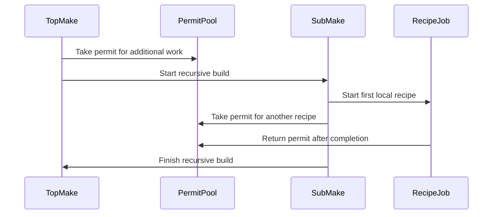

# Chapter 10: jobserver

You run:

```sh
make -j8
```

Then one recipe starts a recursive build:

```make
all:
	$(MAKE) -C library
```

The submake starts more recipes. Perhaps it starts another submake. How does GNU Make prevent this from becoming:

```text
top make starts eight jobs
submake starts eight more
nested submake starts eight more
```

A local `-j8` counter inside each Make process would not be enough. Each process could independently believe that it owns eight worker slots.

GNU Make solves this with a shared pool of tokens called the **jobserver**.

Think of the jobserver as a shared bucket of parking permits:

- a permit allows one additional job to start;
- the top-level Make creates a limited number of permits;
- recursive Make processes use the same bucket;
- when a job ends, its permit goes back;
- no matter how many Make managers exist, the total number of active jobs stays bounded.

The jobserver is the missing coordination layer after [new_job](09_new_job.md): `new_job()` knows how to launch one recipe, but the jobserver decides whether the wider recursive build has capacity for it.

## Why one Make process always gets one free job

The jobserver does not put one token into its pool for every requested job.

Suppose the user asks for:

```sh
make -j4
```

In `main.c`, the top-level Make creates a jobserver with:

```c
if (job_slots > 1 && jobserver_setup (job_slots - 1, jobserver_style))
  {
    master_job_slots = job_slots;
    job_slots = 0;
  }
```

The important subtraction is:

```text
requested parallelism: 4
tokens placed in shared pool: 3
free job held by each Make process: 1
```

Why only three tokens?

Every Make process is allowed to start one job without first taking a token from the shared pool. The top-level Make therefore needs only three extra permits to reach four concurrent jobs.

This avoids a nasty startup problem. Imagine a recursive Make that had to acquire a token before starting *any* work. If all tokens were temporarily held elsewhere, the recursive Make could be alive but unable to do its first useful action.

Instead, each Make process begins with one built-in permit:

```text
one local free permit
plus any permits acquired from the shared pool
```

The source comment in `main.c` states the rule directly:

> Every make assumes that it always has one job it can run.

For a submake, that “free” permit corresponds to the permit already held by the parent while the recursive Make command runs.

## The token pool is a pipe or FIFO

On POSIX systems, jobserver support lives in `src/posixos.c`.

The simplest implementation uses a pipe:

```c
static int job_fds[2] = { -1, -1 };
static char token = '+';
```

The two file descriptors are:

| Descriptor | Purpose |
|---|---|
| `job_fds[0]` | Read one available token |
| `job_fds[1]` | Write one returned token |

The token itself is just a byte:

```c
static char token = '+';
```

Its character value is unimportant. A token could be `+`, `x`, or any other byte. What matters is that one byte represents one permit.

During setup, Make fills the pipe:

```c
while (slots--)
  {
    EINTRLOOP (r, write (job_fds[1], &token, 1));
  }
```

For `make -j4`, `slots` is three. The pipe begins with:

```text
+ + +
```

Each successful read removes one permit. Each successful write returns one permit.

Like a parking booth handing out numbered tags, the text printed on the tag does not matter. The limited number of tags is the policy.

## FIFO jobservers use a named shared pipe

GNU Make can also use a named FIFO, depending on build configuration and jobserver style.

The setup path creates a private FIFO in the temporary directory:

```c
sprintf (fifo_name, "%s/GMfifo%lld", tmpdir, (long long) make_pid ());
```

Then Make opens it for reading and writing:

```c
job_fds[0] = open (fifo_name, O_RDONLY|O_NONBLOCK);
job_fds[1] = open (fifo_name, O_WRONLY);
```

A FIFO has one useful difference from an anonymous pipe:

- a pipe client needs inherited file descriptors;
- a FIFO client can reopen the named FIFO from its pathname.

The jobserver authorization string reflects that distinction.

For a pipe, it looks conceptually like:

```text
readfd,writefd
```

For a FIFO, it looks like:

```text
fifo:path-to-named-pipe
```

The formatter is `jobserver_get_auth()`:

```c
if (js_type == js_fifo)
  sprintf (auth, "fifo:%s", fifo_name);
else
  sprintf (auth, "%d,%d", job_fds[0], job_fds[1]);
```

Both forms describe the same thing: where a recursive Make should find the shared permit bucket.

## `MAKEFLAGS` carries the jobserver address

A recursive Make process needs to know that a jobserver exists and how to reach it.

The top-level Make stores the authorization text in:

```c
jobserver_auth = jobserver_get_auth ();
```

Then `define_makeflags()` places it into `MAKEFLAGS`, which Make exports to child commands.

A recursive Make therefore receives an environment conceptually like:

```text
MAKEFLAGS=... --jobserver-auth=3,4 -j
```

The exact descriptor numbers vary by process and platform. The important part is that `MAKEFLAGS` says:

```text
A shared jobserver exists.
Here is its authorization data.
```

At startup, a submake sees `jobserver_auth` and attempts to join the existing group:

```c
if (jobserver_auth)
  {
    if (argv_slots == INVALID_JOB_SLOTS)
      {
        if (jobserver_parse_auth (jobserver_auth))
          goto job_setup_complete;
```

If parsing succeeds, the submake does not create a new independent pool. It sets:

```c
job_slots = 0;
```

That value means:

```text
Do not use the old local slot counter.
Use jobserver tokens instead.
```

This is the crucial recursive-build property:

```text
top make
    ↓ shares authorization
submake
    ↓ joins same token pool
nested submake
    ↓ joins same token pool
all makes
    ↓ compete for the same limited permits
```

## A recursive Make must inherit the descriptors

Passing `--jobserver-auth=3,4` is not enough for a pipe-based jobserver.

The submake must also inherit file descriptors `3` and `4`.

Normally, GNU Make marks jobserver descriptors close-on-exec:

```c
fd_noinherit (job_fds[0]);
fd_noinherit (job_fds[1]);
```

That is deliberate. Ordinary child commands do not need access to Make’s internal permit pool.

Just before launching a recognized recursive Make command, GNU Make temporarily makes the descriptors inheritable:

```c
void
jobserver_pre_child (int recursive)
{
  if (recursive && js_type == js_pipe)
    {
      fd_inherit (job_fds[0]);
      fd_inherit (job_fds[1]);
    }
}
```

After launching the child, it restores the normal close-on-exec protection:

```c
void
jobserver_post_child (int recursive)
{
  if (recursive && js_type == js_pipe)
    {
      fd_noinherit (job_fds[0]);
      fd_noinherit (job_fds[1]);
    }
}
```

This is like temporarily giving a subcontractor a key to the shared parking garage, then taking the key back from the dispatch desk after they leave.

The `recursive` argument comes from recipe classification in [new_job](09_new_job.md). GNU Make recognizes these forms as recursive:

```make
$(MAKE) -C library
```

```make
+$(MAKE) -C library
```

The `+` prefix explicitly marks a recipe line as recursive. GNU Make also notices literal `$(MAKE)` or `${MAKE}` references while parsing recipe flags.

## Why the `+` prefix matters

This recipe is correct:

```make
all:
	$(MAKE) -C library
```

This is risky:

```make
all:
	make -C library
```

The second line may invoke GNU Make, but the parent Make does not necessarily recognize the literal command `make` as a recursive Make invocation.

That can lead to the familiar warning:

```text
warning: jobserver unavailable: using -j1. Add '+' to parent make rule.
```

The submake received jobserver authorization through `MAKEFLAGS`, but its expected pipe descriptors were closed during `exec()`.

The safest forms are:

```make
all:
	$(MAKE) -C library
```

or:

```make
all:
	+$(MAKE) -C library
```

Use `+` when you want to make the recursive intent unmistakable, especially in generated recipes or unusual shell wrappers.

The `+` prefix also affects modes such as `make -n`. A recursive Make command may still run because GNU Make needs it to propagate behavior correctly through the recursive build.

## Acquiring a permit before a job starts

The main jobserver logic appears near the end of `new_job()` in `src/job.c`.

Before starting a new recipe job, Make checks whether it can use its free permit:

```c
if (!jobserver_tokens)
  break;
```

If `jobserver_tokens` is zero, this Make instance has no running jobs. It may start one job using its free permit.

If it already has a job running, it must acquire another token:

```c
got_token = jobserver_acquire (waiting_jobs != NULL);

if (got_token == 1)
  break;
```

After Make has permission to proceed, it records that another job is active:

```c
++jobserver_tokens;
```

The local counter does not represent the total global pool. It records how many permits this Make process is currently using.

For example, a single Make process might have:

```text
jobserver_tokens: 1
meaning: one running job uses this Make process free permit
```

Then it starts another job:

```text
read one token from shared pool
jobserver_tokens becomes 2
```

Then a third:

```text
read another token
jobserver_tokens becomes 3
```

The global limit still holds because every permit beyond the first required a token read.

## Releasing a permit after work finishes

When a child job completes, `reap_children()` eventually frees its `struct child` record.

`free_child()` handles the jobserver accounting:

```c
if (jobserver_enabled () && jobserver_tokens > 1)
  {
    jobserver_release (1);
  }

--jobserver_tokens;
```

The condition `jobserver_tokens > 1` is the key.

If this Make process had only one running job, that job used its free permit. No pipe token was consumed, so no token should be returned.

If it had two or more running jobs, all jobs beyond the first consumed shared tokens. When one finishes, Make writes a token back:

```c
jobserver_release (1);
```

The write is simple:

```c
EINTRLOOP (r, write (job_fds[1], &token, 1));
```

The lifecycle is:

```text
available token in pool
    ↓
Make reads token
    ↓
another recipe starts
    ↓
recipe finishes
    ↓
Make writes token back
```

A permit is not destroyed when work ends. It returns to the shared bucket for another Make process to use.

## A recursive example

Consider this layout:

```make
# Top-level Makefile
all:
	$(MAKE) -C lib
	$(MAKE) -C app
```

Suppose the user runs:

```sh
make -j3
```

The top-level Make creates:

```text
one local free permit
two shared tokens
```

Now imagine it starts the `lib` submake.

1. The top-level Make starts the recursive command.
2. If it is the first active job, it uses its free permit.
3. The `lib` submake starts.
4. The `lib` Make process has one free permit of its own.
5. The `lib` submake can start one recipe immediately.
6. To start a second recipe, it must read one of the two shared tokens.
7. To start a third recipe, it must read the final shared token.
8. No further recipe can start until another job returns a token.

The effective running work can look like:

```text
top-level recursive Make command
lib recipe one
lib recipe two
```

The parent’s recursive command is itself part of the accounting. Its held permit becomes the submake’s ability to run its first job.

This is why the “one free job per Make process” rule does not multiply the global limit uncontrollably. A submake exists because its parent already holds a permit for the recursive invocation.



## Waiting for tokens without missing finished children

Waiting for a token sounds simple:

```c
read (job_fds[0], &intake, 1);
```

But GNU Make must also notice when one of its own child processes finishes.

Imagine this timing:

1. Make checks for completed children.
2. No child appears complete yet.
3. Make blocks waiting for a jobserver token.
4. One local child exits and should return a token.
5. Make must wake up, reap that child, and release its permit.

GNU Make has two platform-dependent strategies.

On systems with `pselect()`, `jobserver_acquire()` waits for either:

- the jobserver read descriptor to become readable; or
- `SIGCHLD` to indicate a child exited.

The important call is:

```c
r = pselect (job_fds[0]+1, &readfds, NULL, NULL, specp, &empty);
```

On systems without `pselect()`, Make uses a duplicate read descriptor:

```c
EINTRLOOP (job_rfd, dup (job_fds[0]));
```

The child-exit signal handler closes that duplicate:

```c
void
jobserver_signal ()
{
  if (job_rfd >= 0)
    {
      close (job_rfd);
      job_rfd = -1;
    }
}
```

A blocked read on the duplicate then fails with `EBADF`, waking Make so it can reap children and retry.

This is careful concurrency engineering. The jobserver cannot merely wait for a permit and ignore local child exits, because local completions may be exactly what makes new capacity available.

It is like waiting at a ticket counter while also listening for a radio message that a worker has returned a badge.

## Load limits can delay an already-authorized job

The jobserver limits total parallelism. The `-l` option adds another policy:

```sh
make -j8 -l2.0
```

This means:

```text
Never exceed the jobserver permit limit.
Also avoid starting more local work when system load is high.
```

A job can have a permit available but still wait because `load_too_high()` says the machine is busy.

Those delayed jobs live in:

```c
static struct child *waiting_jobs = 0;
```

Before blocking indefinitely for a jobserver token, Make calls:

```c
got_token = jobserver_acquire (waiting_jobs != NULL);
```

The argument requests a timeout when jobs are waiting for load conditions to improve.

That timeout lets Make periodically return to:

```c
start_waiting_jobs ();
```

The result is a two-part policy:

```text
jobserver token: global permission exists
load average: local machine should accept more work now
```

A parking permit lets a car enter the site, but a local traffic controller may still hold it at the gate until congestion clears.

## Why ordinary commands should not receive jobserver access

A recipe may run arbitrary tools:

```make
app:
	./code-generator
	./test-runner
	$(MAKE) -C plugins
```

Only the recursive Make command needs jobserver access.

For non-recursive commands, `target_environment()` may invalidate pipe-based jobserver authorization in `MAKEFLAGS`:

```c
if (!recursive && jobserver_auth)
  invalid = jobserver_get_invalid_auth ();
```

For a pipe jobserver, the invalid authorization is:

```text
--jobserver-auth=-2,-2
```

`jobserver_parse_auth()` recognizes that as invalid:

```c
if (rfd == -2 || wfd == -2)
  return 0;
```

This prevents an arbitrary program that happens to launch `make` from accidentally believing it has valid jobserver access.

There is one implementation detail worth knowing: `new_job()` builds one environment for a target’s whole recipe, and it may know that some line in the recipe is recursive. The source comment calls this a “slight inaccuracy.” Still, jobserver file descriptors remain close-on-exec for commands not classified as recursive, which is the decisive protection for pipe jobservers.

The rule for Makefile authors remains simple:

> Invoke submakes with `$(MAKE)`, not a hard-coded `make`.

## What happens when a submake forces its own `-j`

Suppose a parent build uses a jobserver:

```sh
make -j8
```

but a child recipe runs:

```make
all:
	$(MAKE) -j2 -C subdir
```

The explicit `-j2` says that the submake should not use the parent’s shared pool. GNU Make warns:

```text
warning: -j2 forced in submake: resetting jobserver mode.
```

The submake becomes the master of a new jobserver group.

This can oversubscribe the machine because the parent and child no longer coordinate through one permit bucket.

The same issue can occur if a Makefile changes `MAKEFLAGS` to set `-j` after joining a parent jobserver. `main.c` detects the conflict and resets jobserver mode.

The practical recommendation is:

```make
# Good: inherit parent parallelism
$(MAKE) -C subdir
```

```make
# Usually avoid: creates independent parallel policy
$(MAKE) -j2 -C subdir
```

A recursive build works best when the top-level invocation owns the concurrency decision.

## Jobserver startup and shutdown checks

At the end of the build, GNU Make verifies that permits were returned.

`clean_jobserver()` checks whether the current Make process still claims tokens:

```c
if (jobserver_enabled() && jobserver_tokens)
  {
    ON (error, NILF,
        "INTERNAL: Exiting with %u jobserver tokens", jobserver_tokens);
  }
```

For the top-level controller, Make drains the shared pool:

```c
unsigned int tokens = 1 + jobserver_acquire_all ();
```

The extra `1` represents the root Make’s own free permit.

Then it checks that the expected number returned:

```c
if (tokens != master_job_slots)
  ONN (error, NILF,
       "INTERNAL: Exiting with %u jobserver tokens available", tokens);
```

This is an internal consistency check, like counting every parking permit at closing time.

For a FIFO jobserver, the root Make also removes the named pipe during cleanup:

```c
if (job_root)
  unlink (fifo_name);
```

Only the root owns this cleanup responsibility. Recursive clients must not delete the shared coordination object while the overall build still needs it.

## Debugging jobserver behavior

Jobserver behavior is easiest to inspect with job debugging:

```sh
make -j4 --debug=j
```

You may see messages like:

```text
Using jobserver controller 3,4
Need a job token; we have children
Obtained token for child
Released token for child
```

To inspect the propagated options, add a temporary target:

```make
show-flags:
	@echo MAKEFLAGS is $$MAKEFLAGS
	@echo MAKELEVEL is $$MAKELEVEL
```

Then run:

```sh
make -j4 show-flags
```

For recursive builds, use:

```make
all:
	+$(MAKE) -C subdir show-flags
```

The submake should show a larger `MAKELEVEL` and jobserver-related content in `MAKEFLAGS`.

If you see:

```text
warning: jobserver unavailable: using -j1. Add '+' to parent make rule.
```

check these first:

1. Did the parent invoke the submake with `$(MAKE)`?
2. Is the recipe line hidden behind a shell wrapper that Make cannot recognize?
3. Did the submake force its own `-j` option?
4. Did a non-Make tool launch the submake after jobserver descriptors were closed?

## Reading the source without getting lost

These landmarks provide a useful map:

| Question | Main location |
|---|---|
| Where does the top-level Make create a jobserver? | `main()` in `src/main.c` |
| Where does a submake parse inherited authorization? | `jobserver_parse_auth()` in `src/posixos.c` |
| How is authorization formatted for `MAKEFLAGS`? | `jobserver_get_auth()` in `src/posixos.c` |
| Where are initial tokens written? | `jobserver_setup()` in `src/posixos.c` |
| Where does `new_job()` request a token? | `new_job()` in `src/job.c` |
| Where does Make read a permit? | `jobserver_acquire()` in `src/posixos.c` |
| Where does Make return a permit? | `jobserver_release()` in `src/posixos.c` |
| Where are recursive children given inheritable descriptors? | `jobserver_pre_child()` in `src/posixos.c` |
| Where are descriptors protected again? | `jobserver_post_child()` in `src/posixos.c` |
| Where does child completion return capacity? | `free_child()` in `src/job.c` |
| Where does Make validate permits at exit? | `clean_jobserver()` in `src/main.c` |

The most useful orientation question is:

> Is Make deciding whether work is needed, starting a permitted job, or returning permission after the job ends?

Those phases belong to different layers:

```text
update_goal_chain decides whether work is necessary
new_job prepares and starts work
jobserver coordinates global permission
reap_children and free_child return capacity
```

## Key takeaways

The jobserver is GNU Make’s shared permit system for parallel recursive builds.

Its central rules are:

- `make -jN` creates one free permit plus `N - 1` shared tokens.
- A Make process may start its first job without reading a token.
- Each additional concurrent job requires one token from the shared pool.
- Finishing a token-backed job returns a token to the pool.
- Recursive Make commands inherit jobserver authorization through `MAKEFLAGS`.
- Pipe-based jobservers also require inherited file descriptors.
- GNU Make exposes those descriptors only to recognized recursive commands.
- Use `$(MAKE)`, and use `+` when explicit recursive treatment is needed.
- A submake that forces its own `-j` abandons parent coordination and creates a new concurrency group.
- Load limits can delay jobs even when permits are available.
- GNU Make checks token accounting during shutdown to catch internal leaks.

The most important mental model is this:

> Parallelism is not owned by one Make process. It is a shared budget carried through the recursive build tree.

That completes the tour from variable definitions through parsing, dependency graphs, implicit rules, update decisions, recipe execution, and finally shared parallel coordination. The next useful step is to read a real `make --debug=j -j` trace alongside these chapters and watch the permits move through an actual build.