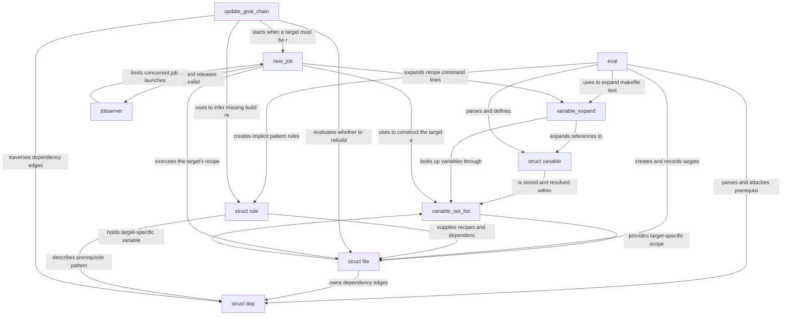

# make-4.4.1

_Lens: beginner-tutorial_

GNU Make is a build automation tool that reads makefiles, represents targets and prerequisites as an in-memory graph, and rebuilds only the files that need updating. It also expands variables and functions, discovers implicit build rules, runs recipes through shells, and coordinates parallel work across recursive make processes.

## Architecture

## Chapters

- [struct variable](01_struct_variable.md)
- [variable_set_list](02_variable_set_list.md)
- [variable_expand](03_variable_expand.md)
- [eval](04_eval.md)
- [struct file](05_struct_file.md)
- [struct dep](06_struct_dep.md)
- [struct rule](07_struct_rule.md)
- [update_goal_chain](08_update_goal_chain.md)
- [new_job](09_new_job.md)
- [jobserver](10_jobserver.md)