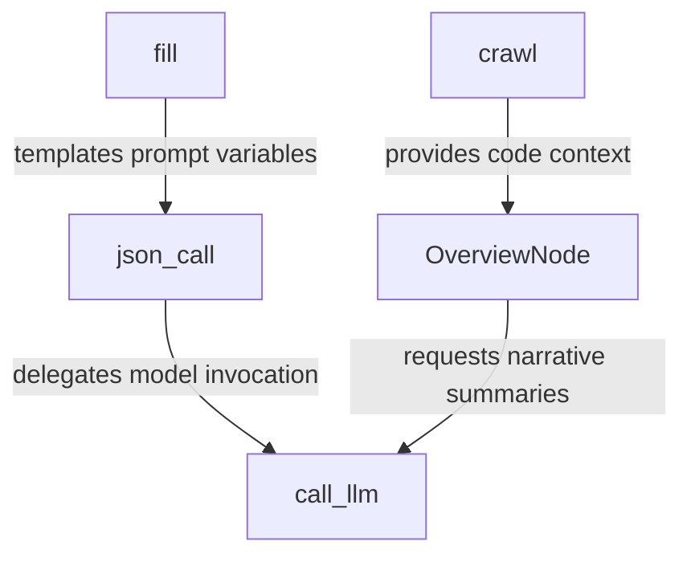

# utils

_Lens: onboarding-guide_

This repository provides a reusable Python toolkit for analyzing codebases and generating technical documentation using large language models. It abstracts away model selection, file crawling, prompt templating, and structured response parsing into a cohesive, cache-friendly workflow pipeline.

## Architecture

## Chapters

- [crawl](01_crawl.md)
- [call_llm](02_call_llm.md)
- [fill](03_fill.md)
- [json_call](04_json_call.md)
- [OverviewNode](05_overviewnode.md)